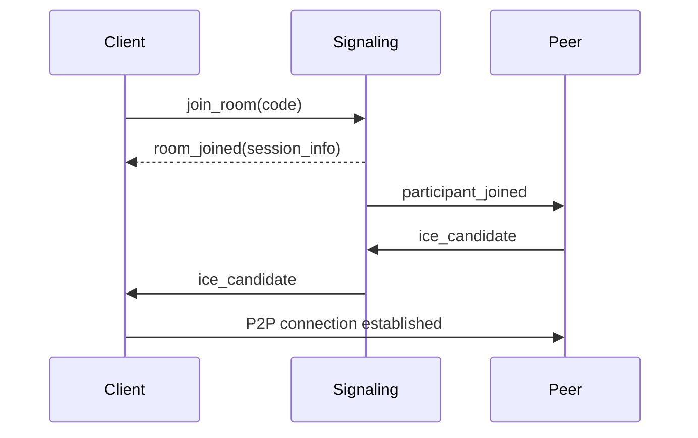
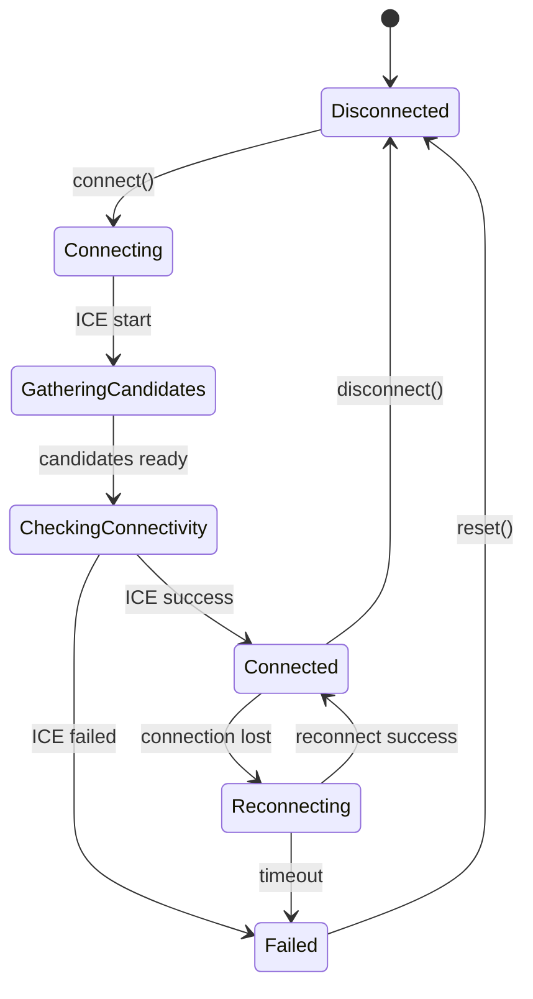

# CLAUDE.md

This file provides guidance to Claude Code (claude.ai/code) when working with code in this repository.

## プロジェクト概要

P2P音声通信アプリ（macOS / Windows / Linux ネイティブ動作）

---

## 最優先要件

**低遅延と音質は最優先事項である。**

音楽セッション用途では30ms以上の遅延で演奏の心地よさを失う。
このため、以下を設計の最優先事項とする:

- アプリ起因の遅延を限りなく0msに近づける（目標: 片道 < 2ms）
- 遅延 ≒ ネットワークRTT となることを目指す
- 音質は非圧縮PCM（32-bit float）をデフォルトとする
- 帯域効率より遅延削減を優先する
- 日本国内光回線（RTT 10-25ms）での使用を主な対象とする

これらの要件は他の設計判断より優先される。詳細は ADR-008 を参照。

---

## 仕様書作成ガイドライン

本プロジェクトでは AI→AI パイプラインを前提とする。
- 仕様書を Claude Code が作成
- その仕様書を再び Claude Code が実装

### 基本原則

#### 1. 質問・提案時のルール
- 質問や提案をするときは、要件から判断した推奨案を必ず添える
- 推奨理由を明示する（なぜその案が最適か）
- 選択肢を提示する場合は、推奨案を最初に置く

❌ 悪い例
```
どちらを修正しますか？
- 仕様を修正
- 実装を修正
```

⭕ 良い例
```
どちらを修正しますか？
- 実装を修正（推奨）: 仕様書が正であり、ADR-002で決定済みのため
- 仕様を修正: 実装の設計がより実用的な場合
```

#### 2. 並列作業の効率化
- 独立した作業は並列で実行する（ファイル読み込み、検索、エージェント起動など）
- コンフリクトの可能性がある作業は順序を制御する
- 依存関係を考慮して最適な実行順序を判断する

並列実行の判断基準:
| 状況 | 実行方法 |
|-----|---------|
| 複数ファイルの読み込み | 並列 |
| 複数の独立した検索 | 並列 |
| 同一ファイルの読み込み→編集 | 順次 |
| 複数ファイルの編集（依存なし） | 並列 |
| 複数ファイルの編集（依存あり） | 順次 |
| ビルド→テスト | 順次 |
| 複数エージェントでの調査 | 並列 |

❌ 悪い例
```
# 1つずつ順番に読み込み
Read file A
Read file B
Read file C
```

⭕ 良い例
```
# 並列で読み込み
Read file A, B, C simultaneously
```

#### 3. AI→AI 向けの記述
- 感情的・抽象的な表現を避ける
- 判断理由を必ず明示する
- 「なぜそうするか」を残す（= ADR）

❌ 悪い例
```
高品質で低遅延な音声通話を実現する
```

⭕ 良い例
```
片方向エンドツーエンド遅延は 150ms 以下を目標とする。
codec は Opus 48kHz / 20ms frame を使用する。
```

#### 2. 仕様書 = 実装の正
- README や口頭説明より `docs-spec/` を正とする
- 実装が仕様から逸脱する場合は必ず理由をコメントする

#### 4. 図解のルール

**ドキュメントには積極的に図解を入れる。**

テキストだけで説明するより、図解があることで理解が格段に速くなる。
特に以下の場面では、図解がないドキュメントは不完全とみなす：

- 複数コンポーネント間の通信フロー
- 状態を持つオブジェクトのライフサイクル
- 処理の順序が重要なシーケンス
- アーキテクチャの全体像

図解作成のルール：
- mermaid で表現可能な図は mermaid を使用する
- mermaid に不向きな図（ASCII アート、複雑なレイアウト等）はその限りではない
- 新規ドキュメント作成時は、図解を入れられる箇所がないか必ず検討する
- 既存ドキュメントを更新する際も、図解追加の機会を見逃さない

##### 必須で図解すべきケース

**シーケンス図（sequenceDiagram）**
一連の処理の流れがある場合は必ずシーケンス図を書く：
- 複数コンポーネント間のメッセージ交換
- API呼び出しの順序が重要な処理
- 非同期処理のフロー



**状態遷移図（stateDiagram-v2）**
状態遷移を管理する必要がある場合は必ずステートマシンを書く：
- 接続状態の管理
- セッションライフサイクル
- UI状態の遷移



##### mermaid 推奨ケース
- フローチャート、シーケンス図、状態遷移図
- クラス図、ER 図
- アーキテクチャ概要図

##### mermaid 不向きケース
- パケットフォーマットのバイナリレイアウト
- 細かい位置調整が必要な図
- 既存の ASCII アートで十分表現できている図

---

## 推奨ディレクトリ構成

```
/docs-spec              # AI→AI パイプライン用仕様書（唯一の正）
 ├─ README.md           # 仕様書概要
 ├─ architecture.md     # 最重要：技術構成
 ├─ adr/                # 設計判断の固定
 │   ├─ ADR-001-*.md
 │   └─ ADR-002-*.md
 ├─ behavior/           # 振る舞い定義（BDD）
 │   ├─ *.feature
 └─ api/                # 境界定義
     ├─ audio_engine.md
     ├─ signaling.md

/docs-site              # Docusaurus 開発者向けドキュメント
 ├─ docs/
 │   ├─ intro.md
 │   ├─ getting-started/
 │   └─ development/
```

---

## architecture.md 作成ルール

### 必須項目（決定事項のみ記載、選択肢や検討中の案は書かない）
- 対応 OS（macOS / Windows / Linux）
- 使用言語（例：C++20 / Rust stable）
- 音声 I/O
  - macOS: CoreAudio
  - Windows: WASAPI
  - Linux: ALSA / PipeWire
- ネットワーク方式（例：WebRTC Native）
- codec（Opus 等）
- スレッドモデル
- リアルタイム制約

### 曖昧さ排除ルール
- 「高速」「高品質」「低遅延」は禁止
- 数値 or 条件で書く

❌ `低遅延を目指す`
⭕ `RTT < 50ms 環境で片方向遅延 < 150ms`

---

## ADR（Architecture Decision Record）

### 役割
- Claude Code が勝手に設計を変えないための杭
- 後から見て「なぜそうなったか」を説明する

### テンプレート

```markdown
# ADR-XXX: <Decision Title>

## Context
なぜこの判断が必要だったか。

## Decision
何を採用 / 不採用にしたか。

## Consequences
この判断によるメリット・デメリット。
```

### 音声通信で必須になりやすいADR
- 通信方式（WebRTC / 独自実装）
- codec 選定
- ネイティブ UI 方針
- Electron / WebView を使わない判断
- リアルタイムスレッドの扱い

---

## BDD / Gherkin 作成ルール

### 目的
- 音声品質・ネットワーク劣化時の振る舞いを明文化
- テストやシミュレーションに直結させる

### 書き方
- 環境条件を `Given` に書く
- ユーザー操作 or イベントを `When`
- 観測可能な結果を `Then`

### 例

```gherkin
Scenario: Packet loss
  Given packet loss is 5%
  When audio streaming is active
  Then audio remains intelligible
```

※「intelligible」が何かは architecture or ADR 側で定義する

---

## API仕様作成ルール

### 目的
- UI / 音声エンジン / ネットワークの責務分離
- AI が境界を越えて実装しないようにする

### 記載項目
- API 名
- 入力
- 出力
- スレッド制約
- 呼び出しタイミング

### 例（audio_engine.md）

```
start_capture(device_id)
- Must be called from non-realtime thread
- Returns immediately
```

---

## 実装フェーズ指示

仕様書完成後、実装時は以下に従う：

- `docs-spec/` 以下を正として実装する
- ADR に記載された判断は変更しない
- リアルタイム制約を破る場合は理由をコメントで残す
- 不明点は `TODO` として明示する
- ソースコードのコメントは英語で記述する

### OSS公開に関する注意事項

本リポジトリは OSS として公開される。以下に配慮すること：

- 機密情報（APIキー、トークン、パスワード等）をコードに含めない
- 内部IPアドレス、内部ホスト名、個人情報を含めない
- テストデータに実在する個人情報やメールアドレスを使用しない
- セキュリティ上のリスクがあるコード（ハードコードされた認証情報、安全でない暗号化方式等）を避ける
- ライセンス互換性のないコードや依存ライブラリを導入しない
- デバッグ用の一時コード（例: 固定ポート、localhost限定設定）を本番コードに残さない

---

## 仕様書と実装の同期ルール

### 基本原則

**実装が仕様書に影響を与える変更を行った場合、同一コミットまたは直後のコミットで仕様書を更新する。**

### 仕様書更新が必要なケース

| 変更内容 | 更新対象ドキュメント |
|---------|---------------------|
| 新規モジュール追加 | docs-spec/architecture.md（モジュール構成） |
| 公開API追加・変更 | docs-spec/api/*.md（該当するAPI仕様） |
| 新規ライブラリ導入 | docs-spec/architecture.md（主要ライブラリ） |
| エラー型追加 | docs-spec/api/*.md（エラーセクション） |
| 設計判断の変更 | docs-spec/adr/ADR-XXX-*.md（新規ADR作成） |
| 機能追加（Phase完了時） | docs-spec/README.md（実装状況） |

### 仕様書更新が不要なケース

- 内部実装の最適化（公開APIに影響なし）
- バグ修正（仕様通りの動作に修正）
- テストコードの追加・修正
- コメント・ドキュメントコメントの修正

### 更新手順

1. 実装変更をコミット
2. 影響を受ける仕様書を特定
3. 仕様書を更新（実装と一致させる）
4. 仕様書更新をコミット（実装コミットと同時でも可）

### コミットメッセージ例

```
Add noise gate effect

Implement NoiseGate with threshold, attack, and release parameters.
Update audio_engine.md to document the new effect.
```

または分割コミット:

```
# コミット1
Add noise gate effect implementation

# コミット2
Update audio_engine.md with NoiseGate API documentation
```

### 仕様書の整合性チェック

実装完了時に以下を確認する：

- [ ] 新規追加した公開構造体・トレイトがAPI仕様に記載されているか
- [ ] モジュール構成図が実際のディレクトリ構成と一致しているか
- [ ] エラー型が全て文書化されているか
- [ ] 実装状況（Phase）が最新か

---

## CI/ローカル環境の整合性ルール

### 基本原則

**CIで動作するコマンドは、ローカル環境（macOS/Windows/Linux）でも同じ手順で動作しなければならない。**

### CI設定変更時の必須チェック

CI（`.github/workflows/*.yml`）を変更する際は、以下を確認する：

1. **ローカル再現性**: CIで実行するコマンドがローカルでも同じ結果になるか
2. **クロスプラットフォーム**: macOS, Windows, Linux全てで動作するか
3. **シェル構文**: Bash固有の構文（`if [ -d ... ]`等）はWindowsで動作しない

### Tauriプロジェクト固有のルール

| 項目 | ルール |
|-----|-------|
| 実行場所 | `cargo tauri dev/build`は**プロジェクトルート**から実行 |
| npm scripts | シェル固有構文を避け、`package.json`のnpm scriptsを使用 |
| beforeDevCommand | `npm run tauri:dev`（package.jsonで定義） |
| beforeBuildCommand | `npm run tauri:build`（package.jsonで定義） |

### 禁止事項

- CIの`working-directory`でのみ動作するコマンド設定
- Bash固有構文（`[ -d ]`, `[[ ]]`, `&&`のネスト等）をtauri.conf.jsonに直接記述
- CIで成功してもローカルでテストせずにマージ

### 問題発生時の対応フロー

1. CIとローカルで動作が異なる場合、**ローカル動作を優先**して修正
2. クロスプラットフォーム対応にはnpm scriptsまたはNode.jsスクリプトを使用
3. 解決策はADRに記録する

---

## Git コミットルール

### 言語
- コミットメッセージは英語で記述する

### 形式
- シンプル形式（feat:, fix: などのプレフィックスは使用しない）
- 1行目: 変更内容の要約（50文字以内を目安）
- 2行目: 空行
- 3行目以降: 必要に応じて詳細説明

### 書き方ルール
- 「何を」「なぜ」変更したかを明確に書く
- 1行目は命令形で書く（例: "Add", "Fix", "Change"）
- 曖昧な表現を避ける

❌ 悪い例
```
Fix
Bug fix
Various changes
```

⭕ 良い例
```
Change audio capture buffer size to 20ms

Adjusted frame size to keep latency under 150ms.
```

### コミット単位
- 1つの論理的な変更につき1コミット
- 複数の無関係な変更を1コミットに混ぜない
- ビルドが通る状態でコミットする

### 禁止事項
- 機密情報（APIキー、トークン等）をコミットしない
- 生成ファイル（build/, dist/ 等）をコミットしない（.gitignore で除外）
