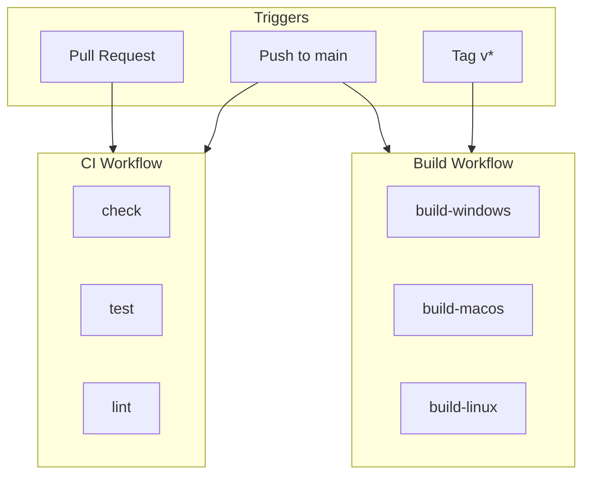

:::note
このドキュメントは開発者向けの解説資料です。
正確な仕様・制約・判断は [docs-spec/](https://github.com/koedame/p2paudiosession/tree/main/docs-spec) を参照してください。
:::

# CI/CD

jamjamの継続的インテグレーション（CI）と継続的デリバリー（CD）について説明します。

## 概要

GitHub Actions を使用して以下を自動化しています:

- コード品質の検証（コンパイル、テスト、lint）
- マルチプラットフォームビルド
- リリース成果物の自動生成

## ワークフロー構成



## CI Workflow

Pull Request および main ブランチへの push 時に実行されます。

| ジョブ | 内容 |
|-------|------|
| check | `cargo check --all-targets` |
| test | `cargo test --all-targets` |
| lint | `cargo fmt --check` + `cargo clippy` |

### マージ要件

Pull Request を main にマージするには以下をすべて満たす必要があります:

- check 成功
- test 成功
- lint 成功（警告なし）

## Build Workflow

main ブランチへの push またはタグ作成時に実行されます。

| OS | runner | 成果物 |
|----|--------|--------|
| Windows | windows-latest | `.msi`, `.exe` |
| macOS | macos-latest | `.dmg`, `.app` |
| Linux | ubuntu-latest | `.AppImage`, `.deb` |

## ローカルでのCI実行

### 手動検証

```bash
# フォーマットチェック
cargo fmt --check

# Lint
cargo clippy --all-targets -- -D warnings

# コンパイルチェック
cargo check --all-targets

# テスト
cargo test --all-targets
```

### act を使用したローカル実行

[act](https://github.com/nektos/act) を使用して GitHub Actions をローカルで実行できます。

```bash
# インストール（macOS）
brew install act

# CI ワークフロー実行
act push -W .github/workflows/ci.yml

# 特定ジョブのみ実行
act push -W .github/workflows/ci.yml -j lint

# ドライラン
act push -W .github/workflows/ci.yml -n
```

:::tip
act は Docker ベースのため、Linux ジョブのみ実行可能です。Windows/macOS ビルドはスキップされます。
:::

## キャッシュ戦略

ビルド時間短縮のため、以下をキャッシュしています:

| 対象 | キー |
|------|-----|
| `~/.cargo/registry` | `cargo-registry-{Cargo.lock hash}` |
| `~/.cargo/git` | `cargo-git-{Cargo.lock hash}` |
| `target/` | `cargo-target-{os}-{Cargo.lock hash}` |

## 関連情報

- [ビルド](/docs/development/building) - ローカルビルド方法
- [テスト](/docs/development/testing) - テスト実行方法
