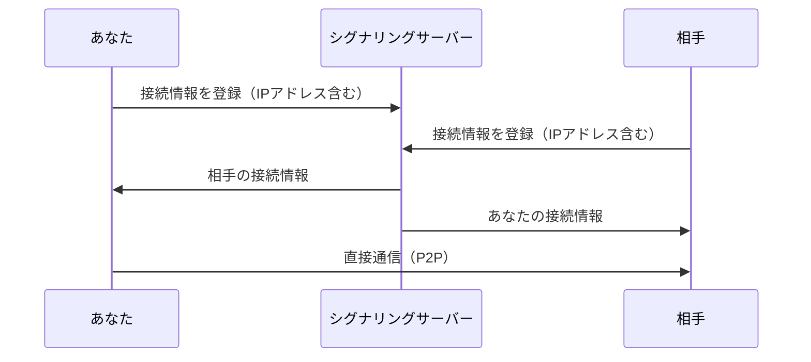

# プライバシーとセキュリティ

jamjamを使用する前に、以下のプライバシーに関する情報をご確認ください。

## P2P通信とIPアドレス

:::warning 重要
jamjamはP2P（Peer-to-Peer）通信を使用しています。**セッション参加者同士でIPアドレスが共有されます。**
:::

### なぜIPアドレスが見えるのか

P2P通信では、音声データを直接相手に送信するために、お互いのIPアドレスを知る必要があります。

### 相手に見える情報

| 情報 | 見える？ | 説明 |
|------|----------|------|
| パブリックIPアドレス | ✓ | インターネット上のIPアドレス |
| 使用ポート番号 | ✓ | UDP通信に使用するポート |
| ユーザー名 | ✓ | セッション参加時に設定した名前 |
| 音声データ | ✓ | 送信した音声（暗号化済み） |
| ローカルIPアドレス | △ | 同一LAN内の場合のみ |

### 相手に見えない情報

- MACアドレス
- OSの種類・バージョン
- その他のネットワークトラフィック

## なぜリレーサーバーを使わないのか

IPアドレスを隠すにはリレーサーバー（TURN）経由で通信する方法がありますが、jamjamでは**遅延最小化を最優先**としているため採用していません。

| 方式 | IPアドレス | 追加遅延 |
|------|-----------|----------|
| P2P直接接続（現在） | 露出する | なし |
| TURN経由 | 隠せる | +10-50ms |

音楽セッションでは10ms以上の遅延増加が演奏体験に大きく影響するため、P2P直接接続を採用しています。

## 推奨される使い方

### 信頼できる相手とのみセッションを行う

- 招待コードは信頼できる相手にのみ共有してください
- 公開ルームへの参加は、IPアドレスが他の参加者に見えることを理解した上で行ってください

### VPNの使用（オプション）

IPアドレスを隠したい場合は、VPNサービスを使用してからjamjamに接続することで、実際のIPアドレスの代わりにVPNサーバーのIPアドレスが相手に見えるようになります。

:::note VPN使用時の注意
VPNを使用すると遅延が増加する可能性があります。低遅延が重要な音楽セッションでは、VPNの遅延特性を確認してから使用してください。
:::

## 通信の暗号化

jamjamは以下の暗号化を実装しています：

| 対象 | 暗号化方式 | 説明 |
|------|-----------|------|
| 鍵交換 | X25519 | 楕円曲線Diffie-Hellman |
| 音声データ | AES-256-GCM | 認証付き暗号化 |

音声データは暗号化されているため、**第三者が通信を傍受しても内容を解読することはできません**。ただし、通信の宛先（IPアドレス）は暗号化できません。

## シグナリングサーバー

シグナリングサーバーは接続の仲介のみを行います：

- ルーム作成・参加の管理
- 参加者間の接続情報の交換
- **音声データはシグナリングサーバーを経由しません**

## まとめ

| 項目 | 状態 |
|------|------|
| 音声データの暗号化 | ✓ 暗号化済み |
| IPアドレスの秘匿 | ✗ 参加者間で共有される |
| 第三者からの傍受 | ✓ 暗号化により保護 |

**jamjamは信頼できる相手との音楽セッションを想定して設計されています。** IPアドレスの共有が問題になる場合は、VPNの使用をご検討ください。
