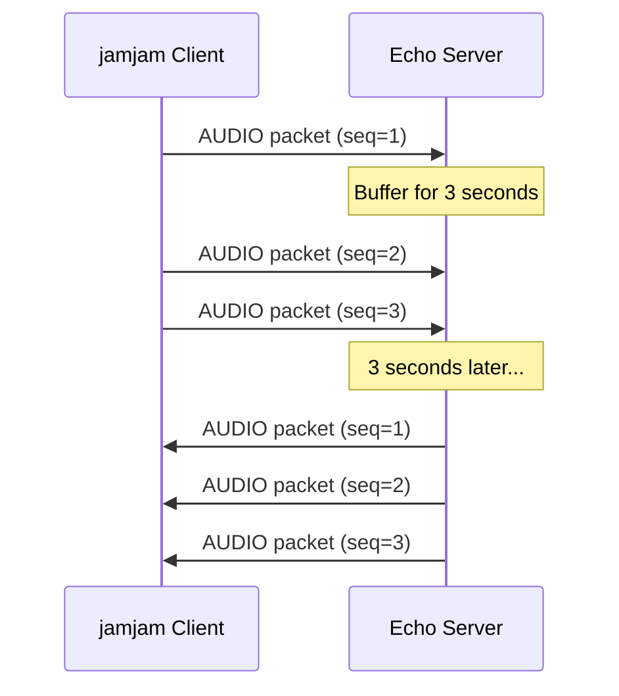
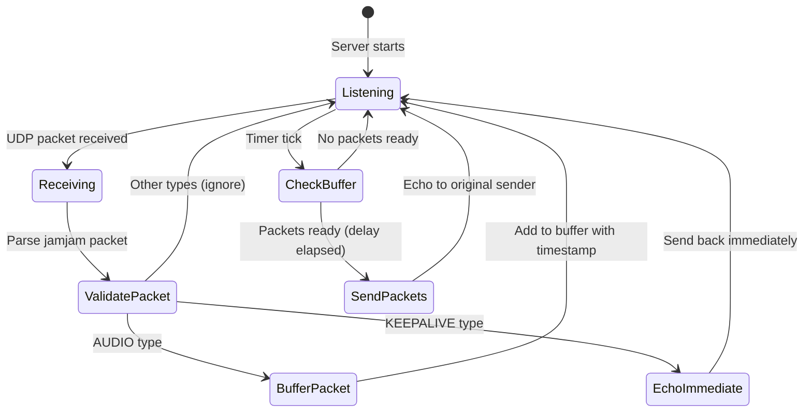
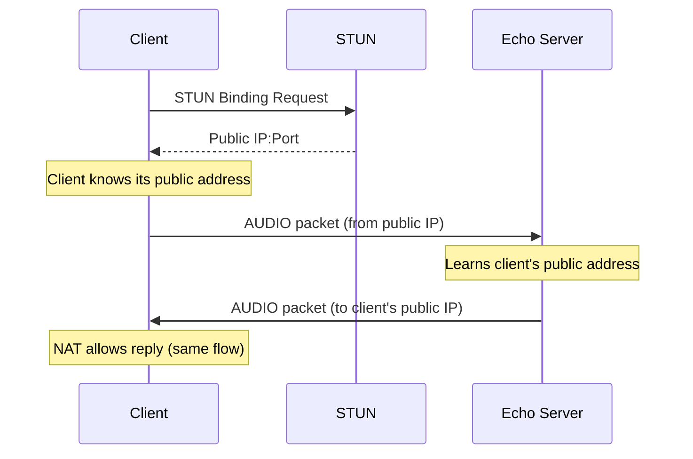
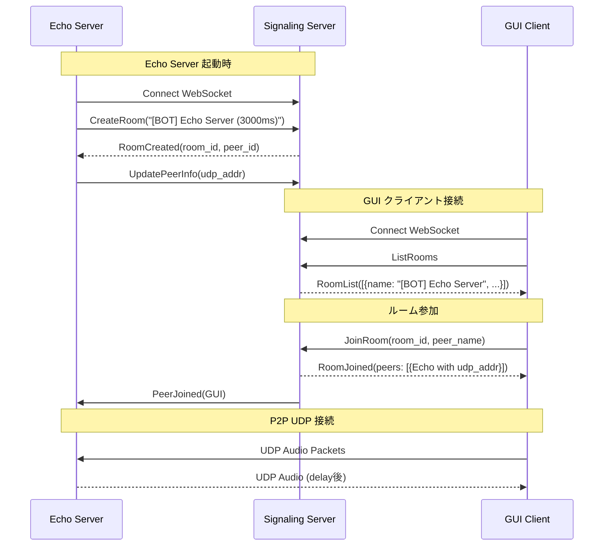

# Echo Server API Specification

## Overview

Echo Server は jamjam クライアントの動作確認用サーバー。受信した音声パケットを設定された遅延後に送信元へ返送する。

## Use Case



## Protocol

Echo Server は jamjam プロトコルの UDP パケットを処理する。

### Supported Packet Types

| Type | Action |
|------|--------|
| `AUDIO` (0x01) | Buffer and echo after delay |
| `KEEPALIVE` (0x04) | Echo immediately (no delay) |
| `FEC` (0x02) | Ignored |
| `CONTROL` (0x03) | Ignored |

### Packet Format

Echo Server は jamjam プロトコルのパケットフォーマットを使用する。
詳細は [architecture.md](../architecture.md) Section 5.2 を参照。

## Configuration

### Command Line Options

```
echo-server [OPTIONS]

OPTIONS:
  -p, --port <PORT>           Listen port (default: 5000)
      --host <HOST>           Bind address (default: 0.0.0.0)
  -d, --delay <MS>            Echo delay in milliseconds (default: 3000)
      --signaling-url <URL>   Signaling server URL for GUI discovery (optional)
      --room-name <NAME>      Room name when using signaling (default: "Echo Server")
      --public-addr <ADDR>    Public address to advertise (defaults to UDP listen address)
  -v, --verbose               Enable debug logging
  -h, --help                  Show help
```

### Environment Variables

| Variable | Description | Default |
|----------|-------------|---------|
| `ECHO_DELAY_MS` | Echo delay in milliseconds | 3000 |
| `SIGNALING_URL` | Signaling server URL (optional) | - |
| `RUST_LOG` | Log level (trace/debug/info/warn/error) | info |

### Docker Configuration

```yaml
echo-server:
  image: jamjam-echo
  ports:
    - "5000:5000/udp"
  environment:
    - ECHO_DELAY_MS=3000
    - RUST_LOG=info
```

## Behavior

### Audio Echo Flow



### Buffer Management

- パケットは `(packet, sender_address, send_at_time)` のタプルとしてバッファに保存
- `send_at_time = receive_time + delay`
- バッファは FIFO キューで管理
- メモリ制限なし（テスト用途のため）

### Statistics

Echo Server は 60 秒ごとに統計情報をログ出力する:

```
INFO Stats: received=1000, sent=1000, buffered=50
```

| Metric | Description |
|--------|-------------|
| `received` | Total packets received |
| `sent` | Total packets echoed |
| `buffered` | Current buffer size |

## Network

### Ports

| Port | Protocol | Description |
|------|----------|-------------|
| 5000 | UDP | Audio packet receive/send |

### NAT Traversal

Echo Server は固定 IP を持つサーバー上で動作する想定。
クライアントは STUN で自身のパブリック IP を取得後、Echo Server へ直接 UDP パケットを送信する。



## Limitations

### Current Limitations

- 認証なし（テスト用途のため）
- 単一サーバーインスタンスのみ（水平スケーリング非対応）
- 永続化なし（再起動でバッファクリア）

### Memory Usage

バッファサイズの見積もり:

| Items | Size |
|-------|------|
| Packet header | 12 bytes |
| Audio payload (20ms @ 48kHz stereo 32-bit) | 7,680 bytes |
| Metadata (address, timestamp) | ~40 bytes |
| **Per packet** | **~7.7 KB** |

3 秒遅延 @ 20ms フレーム = 150 パケット/クライアント
1 クライアント ≈ 1.2 MB

100 同時クライアント ≈ 120 MB （VPS 1GB で問題なし）

## Example Usage

### Local Testing

```bash
# Start echo server
cargo run --bin echo-server -- --port 5000 --delay 1000 --verbose

# In another terminal, send test packet
# (requires jamjam client or custom UDP sender)
```

### Docker

```bash
# Build
docker build -f Dockerfile.echo -t jamjam-echo .

# Run
docker run -p 5000:5000/udp -e ECHO_DELAY_MS=3000 jamjam-echo
```

### With Docker Compose

```bash
docker compose up echo-server
```

## Monitoring

### Health Check

```bash
# Check if process is running
pgrep echo-server
```

### Logs

```bash
# Docker logs
docker compose logs -f echo-server

# Log format
2024-01-15T10:30:00.000Z INFO Echo server listening on 0.0.0.0:5000
2024-01-15T10:30:05.123Z DEBUG Received audio packet seq=1 from 1.2.3.4:54321
2024-01-15T10:30:08.123Z DEBUG Echoed packet seq=1 to 1.2.3.4:54321
2024-01-15T10:31:00.000Z INFO Stats: received=100, sent=100, buffered=0
```

## Signaling Integration

Echo Server はシグナリングサーバーに接続し、GUI クライアントから発見可能なルームを作成する。

### Connection Flow



### Room Naming

シグナリング経由で作成されるルーム名:
- フォーマット: `[BOT] {room_name} ({delay}ms delay)`
- デフォルト: `[BOT] Echo Server (3000ms delay)`
- `[BOT]` プレフィックスで自動化されたサーバーであることを示す

### Example with Signaling

```bash
# Start signaling server
cargo run --bin signaling-server -- --port 8080

# Start echo server with signaling
cargo run --bin echo-server -- --port 5000 --delay 3000 \
  --signaling-url ws://localhost:8080

# GUI client can now:
# 1. Connect to ws://localhost:8080
# 2. List rooms -> see "[BOT] Echo Server (3000ms delay)"
# 3. Join room -> receive echo server's UDP address
# 4. Send audio -> receive delayed echo
```
