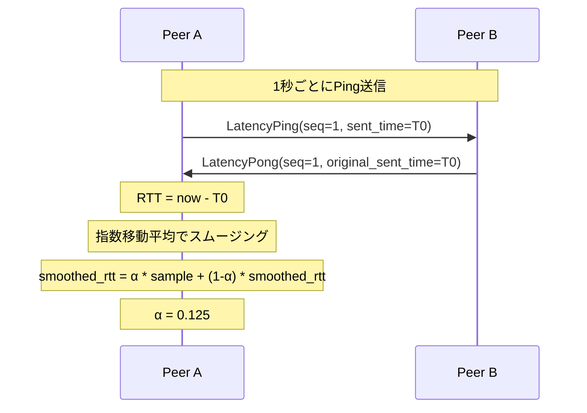

<!-- このドキュメントは実装の正です。変更時は実装も同期すること -->

# Network API

P2P音声通信のネットワークAPI定義。

---

## 1. 概要

Network モジュールは以下の責務を持つ:

- P2P接続の確立・維持
- 音声パケットの送受信
- NAT越え（ICE/STUN/TURN）
- Jitterバッファ管理
- FEC処理
- 帯域推定・適応

---

## 2. モジュール構成

```
network/
├── connection.rs       # 接続管理
├── encryption.rs       # 暗号化レイヤー（AES-GCM, X25519）
├── transport.rs        # UDPトランスポート
├── session.rs          # セッション管理
├── signaling.rs        # シグナリング
├── stun.rs             # STUNクライアント
├── fec.rs              # FEC処理
├── jitter_buffer.rs    # Jitterバッファ
├── latency.rs          # レイテンシ計測・内訳
├── sequence_tracker.rs # シーケンス追跡
└── error.rs            # ネットワークエラー
```

---

## 3. 接続管理 API

### 3.1 接続状態

```rust
/// 接続状態（AtomicU8でアトミックに管理）
#[repr(u8)]
enum ConnectionState {
    /// 切断中
    Disconnected = 0,
    /// 接続試行中
    Connecting = 1,
    /// ICE候補収集中
    GatheringCandidates = 2,
    /// ICE接続中
    CheckingConnectivity = 3,
    /// 接続完了
    Connected = 4,
    /// 再接続中
    Reconnecting = 5,
    /// 失敗（エラー詳細はlast_error()で取得）
    Failed = 6,
}

impl ConnectionState {
    /// 接続済みか
    fn is_connected(&self) -> bool;
    /// 接続処理中か
    fn is_connecting(&self) -> bool;
    /// データ送受信可能か
    fn can_transmit(&self) -> bool;
}
```

エラー情報は状態と分離して管理:

```rust
impl Connection {
    /// 失敗時のエラーメッセージを取得
    fn last_error(&self) -> Option<String>;
}
```

### 3.2 接続確立

```rust
/// P2P接続を確立（ICE使用）
///
/// スレッド: 非リアルタイムスレッドから呼び出すこと
/// ブロッキング: No（非同期、状態変化はコールバックで通知）
///
/// # 引数
/// - remote_session: シグナリングで取得したリモートセッション情報
/// - config: 接続設定
async fn connect(
    remote_session: RemoteSession,
    config: ConnectionConfig,
) -> Result<Connection, ConnectionError>;

/// 直接接続（ICEなし、アドバンスオプション）
///
/// スレッド: 非リアルタイムスレッドから呼び出すこと
/// ブロッキング: No
async fn connect_direct(
    remote_addr: SocketAddr,
    config: ConnectionConfig,
) -> Result<Connection, ConnectionError>;
```

### 3.3 接続設定

```rust
struct ConnectionConfig {
    /// STUN サーバー一覧
    stun_servers: Vec<String>,
    /// TURN サーバー（認証情報付き）
    turn_servers: Vec<TurnServer>,
    /// 暗号化を有効にするか
    enable_encryption: bool,
    /// 接続タイムアウト（ms）
    timeout_ms: u32,
    /// 自動再接続を有効にするか
    auto_reconnect: bool,
}

struct TurnServer {
    url: String,
    username: String,
    credential: String,
}
```

### 3.4 切断

```rust
/// 接続を切断
///
/// スレッド: 任意
/// ブロッキング: No
async fn disconnect(&self) -> Result<(), ConnectionError>;
```

---

## 4. 音声送受信 API

### 4.1 送信

```rust
/// 音声データを送信
///
/// スレッド: 任意（ロックフリー）
/// ブロッキング: No
///
/// # 引数
/// - data: 音声データ（エンコード済み）
/// - timestamp: タイムスタンプ（サンプル単位）
///
/// # 動作
/// 1. シーケンス番号を付与
/// 2. FECデータを生成（設定に応じて）
/// 3. パケットを送信キューに追加
fn send_audio(&self, data: &[u8], timestamp: u64) -> Result<(), NetworkError>;
```

### 4.2 受信

```rust
/// 音声データ受信コールバックを設定
///
/// # コールバック引数
/// - participant_id: 送信元参加者ID
/// - data: 音声データ（デコード前）
/// - timestamp: タイムスタンプ
/// - stats: パケット統計
fn set_audio_callback<F>(&self, callback: F)
where
    F: Fn(ParticipantId, &[u8], u64, PacketStats) + Send + 'static;

struct PacketStats {
    /// シーケンス番号
    sequence: u32,
    /// パケットロスがあったか
    had_loss: bool,
    /// FECで復元されたか
    recovered_by_fec: bool,
}
```

---

## 5. Jitterバッファ API

### 5.1 設定

```rust
/// Jitterバッファ動作モード
#[derive(Debug, Clone, Copy, PartialEq, Eq)]
pub enum JitterBufferMode {
    /// 適応的（デフォルト）- ネットワーク状況に応じて自動調整
    Adaptive,
    /// 固定 - 指定したフレーム数で固定
    Fixed,
    /// パススルー - バッファリングなし、受信即再生（zero-latencyモード用）
    Passthrough,
}

/// Jitterバッファ設定
#[derive(Debug, Clone)]
pub struct JitterBufferConfig {
    /// 動作モード（デフォルト: Adaptive）
    pub mode: JitterBufferMode,
    /// 最小バッファ遅延（フレーム数、デフォルト: 1、Passthrough時は0）
    pub min_delay_frames: u32,
    /// 最大バッファ遅延（フレーム数、デフォルト: 10）
    pub max_delay_frames: u32,
    /// 初期バッファ遅延（フレーム数、デフォルト: 2）
    pub initial_delay_frames: u32,
    /// フレーム長（ミリ秒、デフォルト: 2.5）
    pub frame_duration_ms: f32,
}

impl JitterBufferConfig {
    /// zero-latencyモード用のパススルー設定を作成
    pub fn passthrough() -> Self {
        Self {
            mode: JitterBufferMode::Passthrough,
            min_delay_frames: 0,
            max_delay_frames: 0,
            initial_delay_frames: 0,
            frame_duration_ms: 0.67, // 32 samples @ 48kHz
        }
    }

    /// 設定を検証・正規化
    ///
    /// 以下の正規化が行われる:
    /// - Passthroughモード時は min/max/initial を 0 に設定
    /// - Adaptive/Fixedモードで min_delay_frames が 0 の場合は 1 に補正
    /// - max_delay_frames が min_delay_frames 未満の場合は min に補正
    /// - initial_delay_frames が範囲外の場合はクランプ
    /// - frame_duration_ms が 0 以下の場合はデフォルト値に補正
    pub fn validated(self) -> Self;
}
```

**パススルーモード（Passthrough）について:**

- `zero-latency`プリセット専用のモード
- Jitterバッファによる遅延を完全に排除（0ms）
- 受信したパケットを即座に再生キューに渡す
- ネットワークジッターは音声の乱れとして直接現れる
- 安定した有線LAN環境でのみ推奨

**注意**: `JitterBuffer::with_config()` は内部で `validated()` を呼び出すため、
不正な設定値は自動的に正規化される。

### 5.2 取得結果

```rust
/// Jitterバッファからの取得結果
#[derive(Debug)]
pub enum JitterBufferResult {
    /// パケットあり
    Packet {
        sequence: u32,
        timestamp: u32,
        payload: Vec<u8>,
    },
    /// パケットロス（時間内に受信できず）
    Lost { sequence: u32 },
    /// バッファアンダーラン（パケット不足）
    Underrun,
}
```

### 5.3 JitterBuffer

```rust
/// 適応型Jitterバッファ
///
/// シーケンス番号でインデックス化されたパケットをバッファリングし、
/// ネットワーク状況に応じてバッファサイズを自動調整する。
pub struct JitterBuffer {
    // ... internal fields ...
}

impl JitterBuffer {
    /// デフォルト設定で作成
    pub fn new() -> Self;

    /// カスタム設定で作成
    pub fn with_config(config: JitterBufferConfig) -> Self;

    /// パケットを挿入
    ///
    /// # 引数
    /// - sequence: パケットシーケンス番号
    /// - timestamp: タイムスタンプ（サンプル単位）
    /// - payload: エンコード済み音声データ
    pub fn insert(&mut self, sequence: u32, timestamp: u32, payload: Vec<u8>);

    /// 次のフレームを取得
    ///
    /// シーケンス順でパケットを返す。ロスまたはアンダーランを示す。
    pub fn pop(&mut self) -> JitterBufferResult;

    /// 次のシーケンス番号を確認（削除せず）
    pub fn peek(&self) -> Option<u32>;

    /// 現在のバッファ深度（フレーム数）
    pub fn depth(&self) -> u32;

    /// バッファが空か確認
    pub fn is_empty(&self) -> bool;

    /// 再生開始済みか確認
    pub fn is_playing(&self) -> bool;

    /// 統計情報を取得
    pub fn stats(&self) -> JitterBufferStats;

    /// ネットワーク状況に応じてバッファサイズを適応
    ///
    /// 定期的（例: 100msごと）に呼び出すことでバッファサイズを調整する。
    pub fn adapt(&mut self);

    /// バッファをリセット
    pub fn reset(&mut self);
}
```

### 5.4 統計

```rust
/// Jitterバッファ統計
#[derive(Debug, Clone)]
pub struct JitterBufferStats {
    /// 挿入されたパケット数
    pub packets_inserted: u64,
    /// 再生されたパケット数
    pub packets_played: u64,
    /// ロストパケット数
    pub packets_lost: u64,
    /// 遅延到着パケット数
    pub late_arrivals: u64,
    /// 現在のバッファ深度（フレーム数）
    pub current_depth: u32,
    /// 現在の遅延設定（フレーム数）
    pub current_delay_frames: u32,
    /// ジッター推定値（ms）
    pub jitter_estimate_ms: f32,
}
```

---

## 6. FEC API

> **実装状況**: `FecEncoder`/`FecDecoder` は実装済み。設定用の `FecConfig` 構造体は未実装。

### 6.1 エンコーダ/デコーダ（実装済み）

```rust
/// FECエンコーダ
pub struct FecEncoder {
    /// XOR FECパケットを生成
    pub fn encode(&mut self, packets: &[&[u8]]) -> Option<FecPacket>;
}

/// FECデコーダ
pub struct FecDecoder {
    /// パケットを挿入（FECまたはデータパケット）
    pub fn insert_packet(&mut self, packet: ReceivedPacket);
    /// 回復可能なパケットを取得
    pub fn try_recover(&mut self) -> Vec<RecoveredPacket>;
}

/// FECパケット
pub struct FecPacket {
    pub group_id: u32,
    pub mask: u32,
    pub payload: Vec<u8>,
}

/// 回復されたパケット
pub struct RecoveredPacket {
    pub sequence: u32,
    pub payload: Vec<u8>,
}
```

### 6.2 設定API（計画中）

```rust
// 将来実装予定
struct FecConfig {
    enabled: bool,
    redundancy: f32,
    group_size: u32,
}
```

---

## 7. シーケンストラッカー API

```rust
/// シーケンス番号追跡によるパケットロス検出
///
/// スライディングウィンドウ方式で順序外パケットと
/// シーケンス番号ラップアラウンドを処理する。
pub struct SequenceTracker {
    /// 最後に受信したシーケンス番号
    last_sequence: Option<u32>,
    /// 最大シーケンス番号
    highest_sequence: u32,
    /// 受信ビットマップ（順序外検出用）
    received_bitmap: u64,
    /// 受信パケット総数
    packets_received: u64,
    /// ロストパケット総数
    packets_lost: u64,
    /// ウィンドウサイズ（デフォルト: 64）
    window_size: u32,
}

impl SequenceTracker {
    /// 新規作成
    pub fn new() -> Self;

    /// パケット受信を記録
    ///
    /// # 戻り値
    /// ロスと判定されたシーケンス番号リスト
    pub fn record(&mut self, sequence: u32) -> Vec<u32>;

    /// パケットロス率を取得（0.0〜1.0）
    pub fn loss_rate(&self) -> f32;

    /// 受信パケット数を取得
    pub fn packets_received(&self) -> u64;

    /// ロストパケット数を取得
    pub fn packets_lost(&self) -> u64;

    /// 最大シーケンス番号を取得
    pub fn highest_sequence(&self) -> u32;

    /// 特定のシーケンス番号が受信済みか確認
    pub fn was_received(&self, sequence: u32) -> bool;

    /// 統計をリセット
    pub fn reset(&mut self);
}
```

---

## 8. 帯域推定 API

> **実装状況**: 計画中。帯域推定機能は将来の実装予定。

```rust
/// 帯域推定設定
struct BandwidthConfig {
    /// モード
    mode: BandwidthMode,
    /// 手動設定時のビットレート（bps）
    manual_bitrate: Option<u32>,
    /// 最小ビットレート（bps）
    min_bitrate: u32,
    /// 最大ビットレート（bps）
    max_bitrate: u32,
}

enum BandwidthMode {
    /// 自動適応
    Auto,
    /// 手動設定
    Manual,
}

/// 帯域推定設定を変更
fn configure_bandwidth(&self, config: BandwidthConfig);

/// 現在の推定帯域を取得
fn get_estimated_bandwidth(&self) -> BandwidthStats;

struct BandwidthStats {
    /// 推定利用可能帯域（bps）
    available_bandwidth: u32,
    /// 現在の送信ビットレート（bps）
    current_bitrate: u32,
    /// 推奨ビットレート（bps）
    recommended_bitrate: u32,
}
```

---

## 9. 接続統計 API

```rust
/// 接続統計を取得
fn get_connection_stats(&self) -> ConnectionStats;

struct ConnectionStats {
    /// RTT（ms）
    rtt_ms: f32,
    /// パケットロス率（0.0〜1.0）
    packet_loss_rate: f32,
    /// ジッター（ms）
    jitter_ms: f32,
    /// 送信バイト数
    bytes_sent: u64,
    /// 受信バイト数
    bytes_received: u64,
    /// 送信パケット数
    packets_sent: u64,
    /// 受信パケット数
    packets_received: u64,
    /// 接続時間（秒）
    uptime_seconds: u64,
}
```

---

## 10. レイテンシ計測 API

### 10.1 概要

P2P音声通信のエンドツーエンドレイテンシを計測し、各レイヤー別に内訳を表示する機能。

**測定項目:**
- RTT（Round-Trip Time）: Ping/Pongパケットで計測
- 各レイヤーの遅延: オーディオ設定から計算 + ピア間で情報交換

**レイテンシの構成:**

```
┌─────────────────────────────────────────────────────────────────────────┐
│                      上り（自分 → 相手）                                 │
├─────────────────────────────────────────────────────────────────────────┤
│ [自分] キャプチャ → エンコード → ネットワーク(片道) →                     │
│                    → [相手] ジッターバッファ → デコード → 再生           │
└─────────────────────────────────────────────────────────────────────────┘

┌─────────────────────────────────────────────────────────────────────────┐
│                      下り（相手 → 自分）                                 │
├─────────────────────────────────────────────────────────────────────────┤
│ [相手] キャプチャ → エンコード → ネットワーク(片道) →                     │
│                    → [自分] ジッターバッファ → デコード → 再生           │
└─────────────────────────────────────────────────────────────────────────┘
```

### 10.2 RTT計測プロトコル

LatencyPing/Pongパケットによる定期的なRTT計測。



### 10.3 パケット構造

```rust
/// RTT計測リクエスト
/// PacketType: 0x05
#[derive(Debug, Clone)]
pub struct LatencyPing {
    /// 送信時刻（マイクロ秒、起動時からの経過時間）
    pub sent_time_us: u64,
    /// シーケンス番号
    pub ping_sequence: u32,
}

/// RTT計測レスポンス
/// PacketType: 0x06
#[derive(Debug, Clone)]
pub struct LatencyPong {
    /// リクエスト時の送信時刻（そのまま返す）
    pub original_sent_time_us: u64,
    /// リクエストのシーケンス番号
    pub ping_sequence: u32,
}

/// レイテンシ設定情報
/// PacketType: 0x07
/// 接続時および5秒ごとに送信
#[derive(Debug, Clone)]
pub struct LatencyInfoMessage {
    /// キャプチャバッファ遅延（ms）
    pub capture_buffer_ms: f32,
    /// 再生バッファ遅延（ms）
    pub playback_buffer_ms: f32,
    /// エンコード遅延（ms）
    pub encode_ms: f32,
    /// デコード遅延（ms）
    pub decode_ms: f32,
    /// ジッターバッファ遅延（ms）
    pub jitter_buffer_ms: f32,
    /// フレームサイズ（サンプル数）
    pub frame_size: u32,
    /// サンプルレート（Hz）
    pub sample_rate: u32,
    /// コーデック名
    pub codec: String,
}
```

### 10.4 ピアレイテンシ情報

```rust
/// リモートピアから受信したレイテンシ設定情報
#[derive(Debug, Clone, Default, Serialize, Deserialize)]
pub struct PeerLatencyInfo {
    /// キャプチャバッファ遅延（ms）
    pub capture_buffer_ms: f32,
    /// 再生バッファ遅延（ms）
    pub playback_buffer_ms: f32,
    /// エンコード遅延（ms）
    pub encode_ms: f32,
    /// デコード遅延（ms）
    pub decode_ms: f32,
    /// ジッターバッファ遅延（ms）
    pub jitter_buffer_ms: f32,
    /// フレームサイズ（サンプル数）
    pub frame_size: u32,
    /// サンプルレート（Hz）
    pub sample_rate: u32,
    /// コーデック名
    pub codec: String,
}
```

### 10.5 ローカルレイテンシ情報

```rust
/// ローカルのオーディオ設定から計算されるレイテンシ情報
#[derive(Debug, Clone, Default, Serialize, Deserialize)]
pub struct LocalLatencyInfo {
    /// キャプチャバッファ遅延（ms）= frame_size / sample_rate * 1000
    pub capture_buffer_ms: f32,
    /// 再生バッファ遅延（ms）= frame_size / sample_rate * 1000
    pub playback_buffer_ms: f32,
    /// エンコード遅延（ms）PCM=0, Opus≈2.5
    pub encode_ms: f32,
    /// デコード遅延（ms）PCM=0, Opus≈2.5
    pub decode_ms: f32,
    /// 現在のジッターバッファ遅延（ms）
    pub jitter_buffer_ms: f32,
    /// フレームサイズ（サンプル数）
    pub frame_size: u32,
    /// サンプルレート（Hz）
    pub sample_rate: u32,
    /// コーデック名
    pub codec: String,
}

impl LocalLatencyInfo {
    /// オーディオ設定からローカルレイテンシ情報を生成
    pub fn from_audio_config(frame_size: u32, sample_rate: u32, codec: &str) -> Self;

    /// ジッターバッファ遅延を更新
    pub fn set_jitter_buffer_ms(&mut self, jitter_buffer_ms: f32);
}
```

### 10.6 レイテンシ内訳

```rust
/// 上り（自分 → 相手）レイテンシ内訳
#[derive(Debug, Clone, Default, Serialize, Deserialize)]
pub struct UpstreamLatency {
    /// 自分のキャプチャバッファ遅延
    pub capture_buffer_ms: f32,
    /// 自分のエンコード遅延
    pub encode_ms: f32,
    /// ネットワーク片道遅延（RTT/2）
    pub network_ms: f32,
    /// 相手のジッターバッファ遅延
    pub peer_jitter_buffer_ms: f32,
    /// 相手のデコード遅延
    pub peer_decode_ms: f32,
    /// 相手の再生バッファ遅延
    pub peer_playback_buffer_ms: f32,
}

impl UpstreamLatency {
    /// 合計遅延を計算
    pub fn total(&self) -> f32;
}

/// 下り（相手 → 自分）レイテンシ内訳
#[derive(Debug, Clone, Default, Serialize, Deserialize)]
pub struct DownstreamLatency {
    /// 相手のキャプチャバッファ遅延
    pub peer_capture_buffer_ms: f32,
    /// 相手のエンコード遅延
    pub peer_encode_ms: f32,
    /// ネットワーク片道遅延（RTT/2）
    pub network_ms: f32,
    /// 自分のジッターバッファ遅延
    pub jitter_buffer_ms: f32,
    /// 自分のデコード遅延
    pub decode_ms: f32,
    /// 自分の再生バッファ遅延
    pub playback_buffer_ms: f32,
}

impl DownstreamLatency {
    /// 合計遅延を計算
    pub fn total(&self) -> f32;
}

/// 完全なレイテンシ内訳
#[derive(Debug, Clone, Default, Serialize, Deserialize)]
pub struct LatencyBreakdown {
    /// 上り合計（ms）
    pub upstream_total_ms: f32,
    /// 下り合計（ms）
    pub downstream_total_ms: f32,
    /// 往復合計（ms）
    pub roundtrip_total_ms: f32,
    /// 上り内訳
    pub upstream: UpstreamLatency,
    /// 下り内訳
    pub downstream: DownstreamLatency,
    /// ネットワーク統計
    pub network: NetworkLatencyInfo,
}

impl LatencyBreakdown {
    /// ローカル情報、ピア情報、RTT、ジッターからレイテンシ内訳を計算
    pub fn calculate(
        local: &LocalLatencyInfo,
        peer: Option<&PeerLatencyInfo>,
        rtt_ms: f32,
        jitter_ms: f32,
    ) -> Self;

    /// ピア情報が利用可能か確認
    pub fn has_peer_info(&self) -> bool;
}

/// ネットワークレイテンシ情報
#[derive(Debug, Clone, Default, Serialize, Deserialize)]
pub struct NetworkLatencyInfo {
    /// RTT（ms）
    pub rtt_ms: f32,
    /// 片道遅延推定値（RTT/2, ms）
    pub one_way_ms: f32,
    /// ジッター（ms）
    pub jitter_ms: f32,
    /// パケットロス率（0.0〜1.0）
    pub packet_loss_rate: f32,
}
```

### 10.7 Jitterバッファ遅延取得

```rust
impl JitterBuffer {
    /// 現在のバッファ遅延（ms）を取得
    ///
    /// current_delay_frames * frame_duration_ms で計算
    pub fn current_delay_ms(&self) -> f32;

    /// フレーム長（ms）を取得
    pub fn frame_duration_ms(&self) -> f32;
}
```

### 10.8 表示例（CLI）

```
Peer: Alice (192.168.1.100:5000)
────────────────────────────────
  Upstream (You -> Alice): 10.84 ms
    Capture buffer:     2.67 ms
    Encode (PCM):       0.00 ms
    Network:            7.50 ms
    [Alice] Jitter:     0.00 ms
    [Alice] Playback:   0.67 ms

  Downstream (Alice -> You): 16.18 ms
    [Alice] Capture:    0.67 ms
    [Alice] Encode:     0.00 ms
    Network:            7.50 ms
    Jitter buffer:      5.34 ms
    Playback buffer:    2.67 ms

  Network: RTT 15.00 ms | Jitter 0.82 ms | Loss 0.0%
────────────────────────────────
```

### 10.9 注意事項

- **片道遅延の推定**: RTT/2 として計算（対称ネットワーク仮定）
- **非対称ネットワーク**: 実際の片道遅延と異なる可能性がある
- **Ping/Pongオーバーヘッド**: 1秒1パケット、約20-30バイト（最小限）
- **ピア情報がない場合**: 上り/下りの相手側遅延は0msとして表示

---

## 11. 推奨設定 API

> **実装状況**: 計画中。プリセット推奨機能は将来の実装予定。

ジッター値に基づいて最適なプリセットを推奨する。

```rust
/// 推奨設定を取得
fn get_recommended_settings(&self, participant_id: ParticipantId) -> RecommendedSettings;

/// 推奨設定
#[derive(Debug, Clone)]
pub struct RecommendedSettings {
    /// 推奨プリセット名
    pub recommended_preset: PresetName,
    /// 現在のプリセット名
    pub current_preset: PresetName,
    /// 推奨理由
    pub reason: RecommendationReason,
    /// 接続品質レベル
    pub quality_level: QualityLevel,
    /// 推奨メッセージ（UI表示用）
    pub message: String,
}

/// 推奨理由
#[derive(Debug, Clone, Copy, PartialEq, Eq)]
pub enum RecommendationReason {
    /// ジッターが非常に小さい（< 1ms）
    VeryLowJitter,
    /// ジッターが小さい（1-3ms）
    LowJitter,
    /// ジッターがやや大きい（3-10ms）
    ModerateJitter,
    /// ジッターが大きい（> 10ms）
    HighJitter,
    /// パケットロスが多い
    HighPacketLoss,
}

/// 接続品質レベル
#[derive(Debug, Clone, Copy, PartialEq, Eq)]
pub enum QualityLevel {
    /// 非常に良好 - zero-latency推奨
    Excellent,
    /// 良好 - ultra-low-latency推奨
    Good,
    /// 普通 - balanced推奨
    Fair,
    /// 悪い - high-quality推奨（バッファ増加）
    Poor,
}

/// プリセット名
#[derive(Debug, Clone, PartialEq, Eq)]
pub enum PresetName {
    ZeroLatency,
    UltraLowLatency,
    Balanced,
    HighQuality,
    Custom(String),
}
```

### 推奨ロジック

| ジッター | パケットロス | 品質レベル | 推奨プリセット |
|---------|------------|-----------|--------------|
| < 1ms | < 0.1% | Excellent | zero-latency |
| 1-3ms | < 0.5% | Good | ultra-low-latency |
| 3-10ms | < 1% | Fair | balanced |
| > 10ms | any | Poor | high-quality |
| any | > 1% | Poor | high-quality |

### 使用例

```rust
// 参加者ごとの推奨設定を取得
let recommendation = connection.get_recommended_settings(alice_id);

match recommendation.quality_level {
    QualityLevel::Excellent => {
        // zero-latencyへの切り替えを提案
        ui.show_suggestion(&recommendation.message);
    }
    QualityLevel::Poor => {
        // バッファ増加を警告
        ui.show_warning(&recommendation.message);
    }
    _ => {}
}

// メッセージ例: "非常に安定。zero-latencyモード推奨"
// メッセージ例: "不安定。バッファを増やしてください"
```

---

## 12. イベント

> **実装状況**: 計画中。イベントシステムは将来の実装予定。

```rust
enum NetworkEvent {
    /// 接続状態変化
    StateChanged(ConnectionState),
    /// 参加者追加
    ParticipantJoined(ParticipantId),
    /// 参加者退出
    ParticipantLeft(ParticipantId),
    /// 帯域変化
    BandwidthChanged { old: u32, new: u32 },
    /// 接続品質警告
    QualityWarning(QualityWarning),
}

enum QualityWarning {
    /// 高パケットロス
    HighPacketLoss { rate: f32 },
    /// 高レイテンシ
    HighLatency { rtt_ms: f32 },
    /// 帯域不足
    LowBandwidth { available: u32, required: u32 },
}

/// イベントリスナーを設定
fn set_event_listener<F>(&self, listener: F)
where
    F: Fn(NetworkEvent) + Send + 'static;
```

---

## 13. エラー

```rust
enum NetworkError {
    /// 接続タイムアウト
    ConnectionTimeout,
    /// ICE失敗
    IceFailed(String),
    /// DTLS失敗
    DtlsFailed(String),
    /// 切断された
    Disconnected,
    /// 送信バッファ満杯
    SendBufferFull,
    /// 暗号化エラー
    EncryptionError(String),
    /// 鍵交換失敗
    KeyExchangeFailed(String),
    /// 内部エラー
    Internal(String),
}

enum ConnectionError {
    /// タイムアウト
    Timeout,
    /// シグナリング失敗
    SignalingFailed(String),
    /// NAT越え失敗
    NatTraversalFailed,
    /// 認証失敗
    AuthenticationFailed,
    /// 内部エラー
    Internal(String),
}
```

---

## 14. スレッドモデル

```
┌─────────────────────────────────────────────────────────┐
│                    Main Thread                          │
│  (接続設定、開始/停止)                                   │
└─────────────────────────────────────────────────────────┘
                          │
          ┌───────────────┼───────────────┐
          ▼               ▼               ▼
┌─────────────────┐ ┌─────────────────┐ ┌─────────────────┐
│  Send Thread    │ │ Receive Thread  │ │  ICE Thread     │
│  (高優先度)      │ │  (高優先度)      │ │  (通常)         │
└─────────────────┘ └─────────────────┘ └─────────────────┘
          │               │
          ▼               ▼
┌─────────────────────────────────────────────────────────┐
│                  Jitter Buffer                          │
│               (ロックフリー実装)                          │
└─────────────────────────────────────────────────────────┘
```

---

## 15. 使用例

```rust
// 接続設定
let config = ConnectionConfig {
    stun_servers: vec!["stun:stun.l.google.com:19302".into()],
    turn_servers: vec![],
    enable_encryption: true,
    timeout_ms: 10000,
    auto_reconnect: true,
};

// 接続
let connection = connect(remote_session, config).await?;

// Jitterバッファ設定（balanced モード）
connection.configure_jitter_buffer(JitterBufferConfig {
    mode: JitterBufferMode::Adaptive,
    min_delay_frames: 1,
    max_delay_frames: 10,
    initial_delay_frames: 4,
    frame_duration_ms: 2.67, // 128 samples @ 48kHz
});

// または zero-latency モード用のパススルー設定
// connection.configure_jitter_buffer(JitterBufferConfig::passthrough());

// FEC設定
connection.configure_fec(FecConfig {
    enabled: true,
    redundancy: 0.1,
    group_size: 5,
});

// 受信コールバック
connection.set_audio_callback(|participant, data, timestamp, stats| {
    // デコード & 再生キューに追加
    let decoded = decoder.decode(data);
    playback.enqueue_audio(decoded, timestamp);
});

// イベントリスナー
connection.set_event_listener(|event| {
    match event {
        NetworkEvent::QualityWarning(w) => {
            // UI に警告表示
        }
        _ => {}
    }
});

// 送信
connection.send_audio(&encoded_data, timestamp)?;

// 統計取得
let stats = connection.get_connection_stats();
println!("RTT: {}ms, Loss: {:.1}%", stats.rtt_ms, stats.packet_loss_rate * 100.0);

// 切断
connection.disconnect().await?;
```
