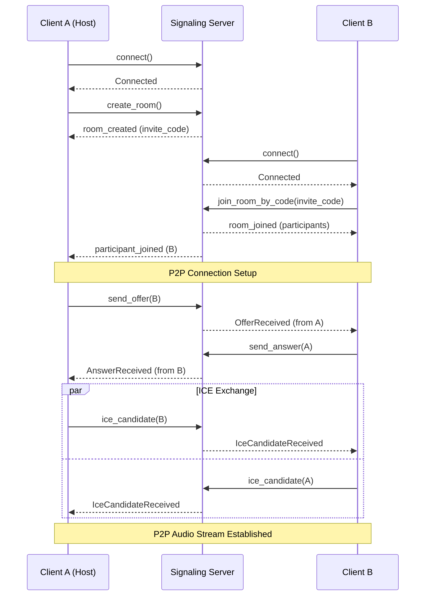
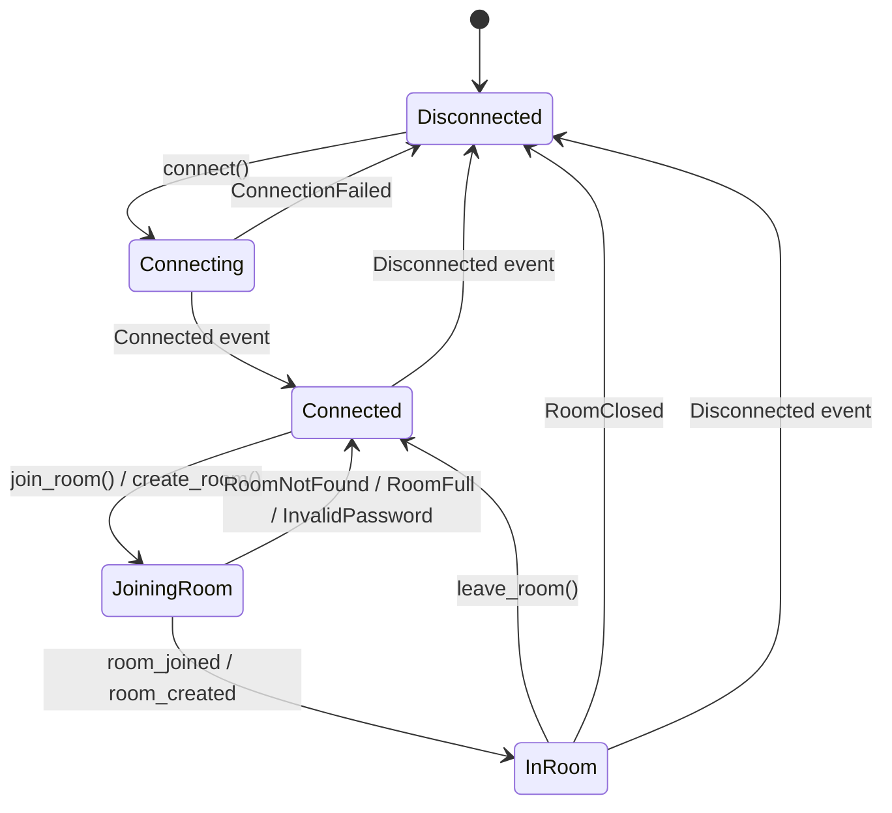

<!-- このドキュメントは実装の正です。変更時は実装も同期すること -->

# Signaling API

シグナリングサーバーとの通信API定義。

---

## 1. 概要

Signalingモジュールは以下の責務を持つ:

- ルームの作成・参加・退出
- ICE候補の交換
- セッション情報の交換
- 参加者リストの管理

シグナリングはP2P接続確立のための補助であり、音声データは経由しない。

### 1.1 通信フロー



---

## 2. プロトコル

| 項目 | 仕様 |
|------|------|
| トランスポート | WebSocket over TLS |
| フォーマット | JSON |
| エンドポイント | `wss://signaling.jamjam.example/v1` |

---

## 3. クライアント API

### 3.1 接続

```rust
/// シグナリングサーバーに接続
///
/// スレッド: 非リアルタイムスレッドから呼び出すこと
/// ブロッキング: No（非同期）
async fn connect(server_url: &str) -> Result<SignalingClient, SignalingError>;
```

### 3.2 ルーム作成

```rust
/// ルームを作成
///
/// # 引数
/// - options: ルーム作成オプション
///
/// # 戻り値
/// - room_id: ルームID（UUID）
/// - invite_code: 招待コード（6文字英数字）
/// - invite_url: 招待URL
async fn create_room(&self, options: CreateRoomOptions) -> Result<RoomInfo, SignalingError>;

struct CreateRoomOptions {
    /// ルーム名（オプション）
    name: Option<String>,
    /// パスワード（オプション、設定するとパスワード保護）
    password: Option<String>,
    /// 最大参加者数
    max_participants: u32,
    /// パブリックルームとして公開するか
    is_public: bool,
}

struct RoomInfo {
    /// ルームID
    room_id: String,
    /// 招待コード
    invite_code: String,
    /// 招待URL
    invite_url: String,
}
```

### 3.3 ルーム参加

```rust
/// ルームに参加（招待コードで）
///
/// # 引数
/// - invite_code: 招待コード（6文字英数字）
/// - options: 参加オプション
async fn join_room_by_code(
    &self,
    invite_code: &str,
    options: JoinRoomOptions,
) -> Result<SessionInfo, SignalingError>;

/// ルームに参加（ルームIDで）
async fn join_room_by_id(
    &self,
    room_id: &str,
    options: JoinRoomOptions,
) -> Result<SessionInfo, SignalingError>;

struct JoinRoomOptions {
    /// 表示名
    display_name: String,
    /// パスワード（パスワード保護されたルームの場合）
    password: Option<String>,
}

struct SessionInfo {
    /// 自分のセッションID
    session_id: String,
    /// 自分の参加者ID
    participant_id: ParticipantId,
    /// ルーム情報
    room: RoomDetails,
    /// 既存の参加者一覧
    participants: Vec<Participant>,
}

struct RoomDetails {
    room_id: String,
    name: Option<String>,
    host_id: ParticipantId,
    created_at: u64,
}

struct Participant {
    id: ParticipantId,
    display_name: String,
    joined_at: u64,
}
```

### 3.4 ルーム退出

```rust
/// ルームから退出
async fn leave_room(&self) -> Result<(), SignalingError>;
```

### 3.5 ルーム終了（ホストのみ）

```rust
/// ルームを終了（全員を切断）
///
/// ホストのみ実行可能
async fn close_room(&self) -> Result<(), SignalingError>;
```

---

## 4. ICE候補交換 API

### 4.1 ICE候補送信

```rust
/// ICE候補を送信
///
/// # 引数
/// - target: 送信先参加者ID
/// - candidate: ICE候補
async fn send_ice_candidate(
    &self,
    target: ParticipantId,
    candidate: IceCandidate,
) -> Result<(), SignalingError>;

struct IceCandidate {
    /// 候補文字列
    candidate: String,
    /// SDPミッドライン
    sdp_mid: String,
    /// SDPミッドラインインデックス
    sdp_mline_index: u32,
}
```

### 4.2 SDP交換

```rust
/// SDPオファーを送信
async fn send_offer(
    &self,
    target: ParticipantId,
    offer: SessionDescription,
) -> Result<(), SignalingError>;

/// SDPアンサーを送信
async fn send_answer(
    &self,
    target: ParticipantId,
    answer: SessionDescription,
) -> Result<(), SignalingError>;

struct SessionDescription {
    /// SDP種別（offer / answer）
    sdp_type: String,
    /// SDP文字列
    sdp: String,
}
```

---

## 5. メッセージ型

シグナリングプロトコルで使用されるメッセージ型。
クライアント↔サーバー間の双方向通信で使用される。

```rust
/// シグナリングメッセージ
///
/// WebSocket JSON形式で送受信される。
/// serde: adjacently tagged format - `#[serde(tag = "type", content = "data")]`
enum SignalingMessage {
    // --- Client → Server ---
    /// ルーム一覧を取得
    ListRooms,
    /// ルームを作成
    CreateRoom {
        room_name: String,
        password: Option<String>,
        peer_name: String,
    },
    /// ルームに参加
    JoinRoom {
        room_id: String,
        password: Option<String>,
        peer_name: String,
    },
    /// ルームから退出
    LeaveRoom,
    /// ピア情報を更新
    UpdatePeerInfo {
        public_addr: Option<SocketAddr>,
        local_addr: Option<SocketAddr>,
    },

    // --- Server → Client ---
    /// ルーム一覧
    RoomList { rooms: Vec<RoomInfo> },
    /// ルーム作成完了
    RoomCreated { room_id: String, peer_id: Uuid },
    /// ルーム参加完了
    RoomJoined {
        room_id: String,
        peer_id: Uuid,
        peers: Vec<PeerInfo>,
    },
    /// ピアが参加
    PeerJoined { peer: PeerInfo },
    /// ピアが退出
    PeerLeft { peer_id: Uuid },
    /// ピア情報が更新された
    PeerUpdated { peer: PeerInfo },
    /// エラー
    Error { message: String },
}

/// ピア情報
struct PeerInfo {
    id: Uuid,
    name: String,
    public_addr: Option<SocketAddr>,
    local_addr: Option<SocketAddr>,
}

/// ルーム情報
struct RoomInfo {
    id: String,
    name: String,
    peer_count: usize,
    max_peers: usize,
    has_password: bool,
}

/// メッセージリスナーを設定
fn set_message_listener<F>(&self, listener: F)
where
    F: Fn(SignalingMessage) + Send + 'static;
```

### 5.1 接続状態遷移



---

## 6. エラー

```rust
enum SignalingError {
    /// 接続失敗
    ConnectionFailed(String),
    /// ルームが見つからない
    RoomNotFound,
    /// ルームが満員
    RoomFull,
    /// パスワードが違う
    InvalidPassword,
    /// 権限がない
    Unauthorized,
    /// タイムアウト
    Timeout,
    /// サーバーエラー
    ServerError(String),
    /// 内部エラー
    Internal(String),
}
```

---

## 7. サーバーサイドプロトコル

### 7.1 メッセージフォーマット

```json
{
  "type": "message_type",
  "payload": { ... },
  "timestamp": 1234567890
}
```

### 7.2 クライアント → サーバー メッセージ

#### create_room

```json
{
  "type": "create_room",
  "payload": {
    "name": "My Room",
    "password_hash": "sha256_hash_or_null",
    "max_participants": 10,
    "is_public": false
  }
}
```

#### join_room

```json
{
  "type": "join_room",
  "payload": {
    "room_id": "uuid",
    "invite_code": "ABC123",
    "display_name": "Player1",
    "password_hash": "sha256_hash_or_null"
  }
}
```

#### leave_room

```json
{
  "type": "leave_room",
  "payload": {}
}
```

#### ice_candidate

```json
{
  "type": "ice_candidate",
  "payload": {
    "target": "participant_id",
    "candidate": {
      "candidate": "candidate:...",
      "sdp_mid": "0",
      "sdp_mline_index": 0
    }
  }
}
```

#### offer

```json
{
  "type": "offer",
  "payload": {
    "target": "participant_id",
    "sdp": {
      "type": "offer",
      "sdp": "v=0\r\n..."
    }
  }
}
```

#### answer

```json
{
  "type": "answer",
  "payload": {
    "target": "participant_id",
    "sdp": {
      "type": "answer",
      "sdp": "v=0\r\n..."
    }
  }
}
```

### 7.3 サーバー → クライアント メッセージ

#### room_created

```json
{
  "type": "room_created",
  "payload": {
    "room_id": "uuid",
    "invite_code": "ABC123",
    "invite_url": "jamjam://join/ABC123"
  }
}
```

#### room_joined

```json
{
  "type": "room_joined",
  "payload": {
    "session_id": "uuid",
    "participant_id": "uuid",
    "room": {
      "room_id": "uuid",
      "name": "My Room",
      "host_id": "uuid",
      "created_at": 1234567890
    },
    "participants": [
      {
        "id": "uuid",
        "display_name": "Player1",
        "joined_at": 1234567890
      }
    ]
  }
}
```

#### participant_joined

```json
{
  "type": "participant_joined",
  "payload": {
    "id": "uuid",
    "display_name": "Player2",
    "joined_at": 1234567890
  }
}
```

#### participant_left

```json
{
  "type": "participant_left",
  "payload": {
    "id": "uuid"
  }
}
```

#### ice_candidate

```json
{
  "type": "ice_candidate",
  "payload": {
    "from": "participant_id",
    "candidate": { ... }
  }
}
```

#### offer

```json
{
  "type": "offer",
  "payload": {
    "from": "participant_id",
    "sdp": { ... }
  }
}
```

#### answer

```json
{
  "type": "answer",
  "payload": {
    "from": "participant_id",
    "sdp": { ... }
  }
}
```

#### room_closed

```json
{
  "type": "room_closed",
  "payload": {
    "reason": "host_closed"
  }
}
```

#### error

```json
{
  "type": "error",
  "payload": {
    "code": "room_not_found",
    "message": "Room not found"
  }
}
```

---

## 8. 使用例

```rust
// シグナリングサーバーに接続
let client = SignalingClient::new("wss://signaling.jamjam.example/v1");
let mut conn = client.connect().await?;

// ルーム作成
conn.send(SignalingMessage::CreateRoom {
    room_name: "Guitar Session".into(),
    password: None,
    peer_name: "Host".into(),
}).await?;

match conn.recv().await? {
    SignalingMessage::RoomCreated { room_id, peer_id } => {
        println!("Room created: {} (peer: {})", room_id, peer_id);
    }
    SignalingMessage::Error { message } => {
        return Err(anyhow::anyhow!("Failed: {}", message));
    }
    _ => {}
}

// または、ルーム参加
conn.send(SignalingMessage::JoinRoom {
    room_id: "ABC123".into(),
    password: None,
    peer_name: "Player1".into(),
}).await?;

match conn.recv().await? {
    SignalingMessage::RoomJoined { room_id, peer_id, peers } => {
        println!("Joined room: {} as {}", room_id, peer_id);
        for peer in &peers {
            println!("  Peer: {} ({})", peer.name, peer.id);
        }
    }
    SignalingMessage::Error { message } => {
        return Err(anyhow::anyhow!("Failed: {}", message));
    }
    _ => {}
}

// 退出
conn.send(SignalingMessage::LeaveRoom).await?;
```
