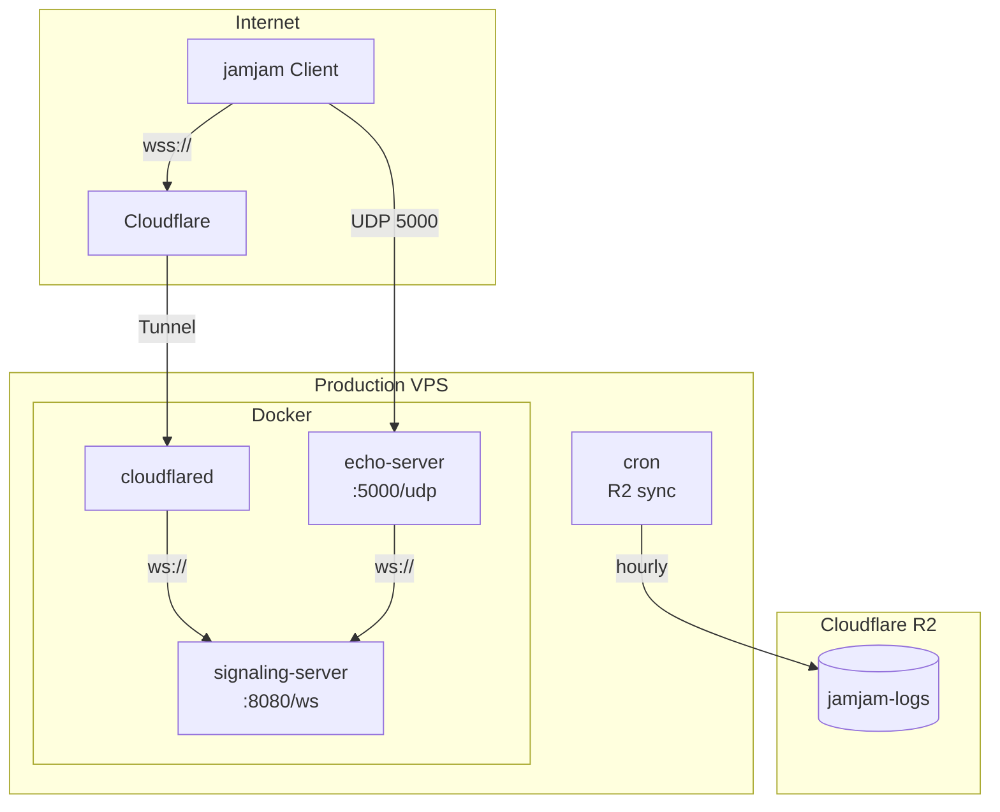

# 本番環境仕様

## 概要

実ユーザー向けの本番環境。
安定性とセキュリティを重視した設定。

## 目的

- 実ユーザーへのサービス提供
- 24時間365日の安定稼働
- ログの長期保存（監査・分析用）

## サーバー構成



## サービス詳細

### signaling-server

WebSocket ベースのシグナリングサーバー。

| 項目 | 値 |
|------|-----|
| ポート | 8080 (WebSocket) |
| 外部公開 | Cloudflare Tunnel 経由（wss://） |
| ドメイン | signaling-jamjam.koeda.me |
| ログレベル | info |

**起動コマンド:**
```bash
signaling-server --port 8080 --host 0.0.0.0
```

### echo-server

音声エコーテスト用サーバー。

| 項目 | 値 |
|------|-----|
| ポート | 5000 (UDP) |
| 外部公開 | 直接公開（UDP） |
| エコー遅延 | 3000ms |
| ログレベル | info |

**起動コマンド:**
```bash
echo-server --port 5000 --host 0.0.0.0 \
  --delay 3000 \
  --signaling-url ws://signaling-server:8080 \
  --public-addr <VPS_IP>:5000
```

### cloudflared

Cloudflare Tunnel クライアント。

| 項目 | 値 |
|------|-----|
| イメージ | cloudflare/cloudflared:latest |
| トンネル名 | jamjam-production |
| 接続先 | signaling-server:8080 |

## 環境変数

```bash
# ログ
RUST_LOG=info

# Echo Server
ECHO_DELAY_MS=3000
ECHO_PUBLIC_ADDR=<VPS_IP>:5000

# Cloudflare
CLOUDFLARE_TUNNEL_TOKEN=<production_tunnel_token>

# R2 Storage
R2_ACCESS_KEY_ID=<access_key>
R2_SECRET_ACCESS_KEY=<secret_key>
R2_ACCOUNT_ID=<account_id>
R2_BUCKET_NAME=jamjam-logs
```

## ファイアウォール設定

```bash
# ufw ルール
ufw default deny incoming
ufw default allow outgoing
ufw allow ssh
ufw allow 5000/udp  # Echo Server
ufw enable
```

| ポート | プロトコル | 許可元 | 用途 |
|--------|----------|--------|------|
| 22 | TCP | any | SSH |
| 5000 | UDP | any | Echo Server |

**注意:** signaling-server (8080) は直接公開しない。Cloudflare Tunnel 経由のみ。

## ログ管理

### Docker ログ

```json
{
  "log-driver": "json-file",
  "log-opts": {
    "max-size": "100m",
    "max-file": "5"
  }
}
```

### R2 ログアップロード

本番環境では**有効**。毎時 Cloudflare R2 にログをアップロード。

**cron 設定:**
```bash
0 * * * * /opt/jamjam/scripts/upload-logs-to-r2.sh
```

**upload-logs-to-r2.sh:**
```bash
#!/bin/bash
set -e

TIMESTAMP=$(date +%Y%m%d_%H%M%S)
LOG_DIR=/var/lib/docker/containers

# ログを圧縮してR2にアップロード
for container_dir in $LOG_DIR/*/; do
  container_id=$(basename $container_dir)
  log_file="${container_dir}${container_id}-json.log"
  if [ -f "$log_file" ]; then
    gzip -c "$log_file" | rclone rcat r2:jamjam-logs/${TIMESTAMP}/${container_id}.log.gz
  fi
done
```

**rclone 設定 (~/.config/rclone/rclone.conf):**
```ini
[r2]
type = s3
provider = Cloudflare
access_key_id = <R2_ACCESS_KEY_ID>
secret_access_key = <R2_SECRET_ACCESS_KEY>
endpoint = https://<R2_ACCOUNT_ID>.r2.cloudflarestorage.com
acl = private
```

### ログ保持期間

| 保存先 | 保持期間 |
|--------|---------|
| Docker ログ（ローカル） | 最新5ファイル（約500MB） |
| R2 | 無期限（手動削除まで） |

## 秘匿情報

| 項目 | 保管場所 |
|------|---------|
| Cloudflare Tunnel トークン（本番用） | Ansible Vault |
| R2 認証情報 | Ansible Vault |
| SSH 鍵 | PrivateDocs/jamjam_vps |
| VPS root パスワード | PrivateDocs/secrets.md |

## デプロイ手順

### Ansible でデプロイ

```bash
ansible-playbook -i ansible/inventory/production.yml ansible/playbooks/site.yml \
  --vault-password-file PrivateDocs/ansible-vault-password
```

### デプロイのみ（設定変更なし）

```bash
ansible-playbook -i ansible/inventory/production.yml ansible/playbooks/deploy.yml \
  --vault-password-file PrivateDocs/ansible-vault-password
```

### ロールバック

```bash
ansible-playbook -i ansible/inventory/production.yml ansible/playbooks/rollback.yml \
  --vault-password-file PrivateDocs/ansible-vault-password
```

## ヘルスチェック

### 手動確認

```bash
# サービス状態
docker compose ps

# signaling-server 疎通確認
curl -I https://signaling-jamjam.koeda.me

# echo-server プロセス確認
docker exec jamjam-echo pgrep echo-server

# R2 アップロード確認
rclone ls r2:jamjam-logs --max-depth 1
```

### 自動ヘルスチェック

Docker Compose のヘルスチェック機能を使用：

- チェック間隔: 30秒
- タイムアウト: 3秒
- リトライ: 3回
- 開始猶予: 5秒

### 外部監視（推奨）

- Cloudflare のヘルスチェック機能
- UptimeRobot などの外部サービス

## テスト環境との差分

| 項目 | テスト環境 | 本番環境 |
|------|----------|---------|
| ドメイン | test-signaling-jamjam.koeda.me | signaling-jamjam.koeda.me |
| `RUST_LOG` | debug | info |
| `ECHO_DELAY_MS` | 1000 | 3000 |
| R2 ログアップロード | 無効 | 有効（毎時） |
| Tunnel トークン | テスト用 | 本番用 |

## 運用手順

### 定期メンテナンス

1. **毎週**: Docker イメージの脆弱性スキャン
2. **毎月**: OS パッケージアップデート
3. **四半期**: Rust/依存ライブラリのアップデート

### 緊急対応

#### サービス再起動

```bash
ssh -i PrivateDocs/jamjam_vps root@<VPS_IP>
cd /opt/jamjam
docker compose restart
```

#### 全サービス停止

```bash
docker compose down
```

#### ログ確認

```bash
docker compose logs --tail 1000 signaling-server
docker compose logs --tail 1000 echo-server
```

## バックアップ

### バックアップ対象

| 対象 | 方法 | 頻度 |
|------|------|------|
| ログ | R2 自動アップロード | 毎時 |
| 設定ファイル | Git 管理（Ansible） | 変更時 |
| 秘匿情報 | Ansible Vault + PrivateDocs | 変更時 |

### リストア手順

1. 新規 VPS を用意
2. Ansible で環境構築
3. 必要に応じて R2 からログをダウンロード

## セキュリティ考慮事項

- SSH は鍵認証のみ（パスワード認証無効化推奨）
- signaling-server は Cloudflare Tunnel 経由のみアクセス可能
- Cloudflare の DDoS 対策を活用
- 秘匿情報は Ansible Vault で暗号化
- root ログインは初期設定時のみ、通常は jamjam ユーザーを使用

## 障害対応連絡先

障害発生時の連絡先は PrivateDocs に記載。
