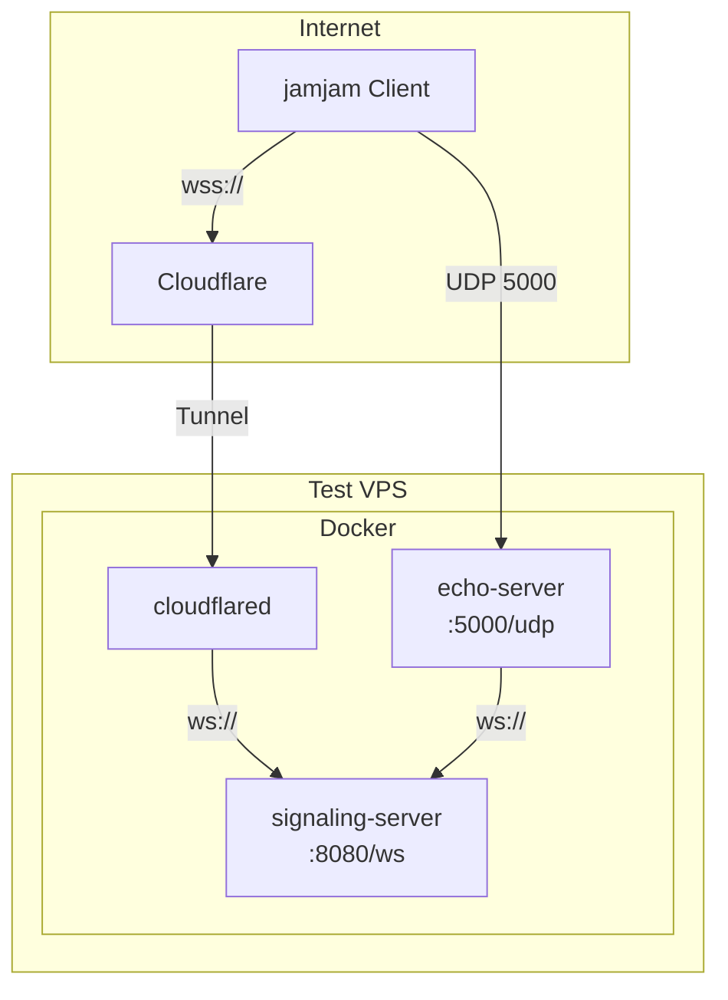

# テスト環境仕様

## 概要

開発・検証用のテスト環境。
本番環境と同じ構成を維持しつつ、デバッグしやすい設定にする。

## 目的

- 新機能の検証
- バグ修正の確認
- パフォーマンス測定
- E2E テストの実行

## サーバー構成



## サービス詳細

### signaling-server

WebSocket ベースのシグナリングサーバー。

| 項目 | 値 |
|------|-----|
| ポート | 8080 (WebSocket) |
| 外部公開 | Cloudflare Tunnel 経由（wss://） |
| ドメイン | test-signaling-jamjam.koeda.me |
| ログレベル | debug |

**起動コマンド:**
```bash
signaling-server --port 8080 --host 0.0.0.0 --verbose
```

### echo-server

音声エコーテスト用サーバー。

| 項目 | 値 |
|------|-----|
| ポート | 5000 (UDP) |
| 外部公開 | 直接公開（UDP） |
| エコー遅延 | 1000ms（テスト用に短め） |
| ログレベル | debug |

**起動コマンド:**
```bash
echo-server --port 5000 --host 0.0.0.0 \
  --delay 1000 \
  --signaling-url ws://signaling-server:8080 \
  --public-addr <VPS_IP>:5000 \
  --verbose
```

### cloudflared

Cloudflare Tunnel クライアント。

| 項目 | 値 |
|------|-----|
| イメージ | cloudflare/cloudflared:latest |
| トンネル名 | jamjam-test |
| 接続先 | signaling-server:8080 |

## 環境変数

```bash
# ログ
RUST_LOG=debug

# Echo Server
ECHO_DELAY_MS=1000
ECHO_PUBLIC_ADDR=<VPS_IP>:5000

# Cloudflare
CLOUDFLARE_TUNNEL_TOKEN=<test_tunnel_token>
```

## ファイアウォール設定

```bash
# ufw ルール
ufw default deny incoming
ufw default allow outgoing
ufw allow ssh
ufw allow 5000/udp  # Echo Server
ufw enable
```

| ポート | プロトコル | 許可元 | 用途 |
|--------|----------|--------|------|
| 22 | TCP | any | SSH |
| 5000 | UDP | any | Echo Server |

**注意:** signaling-server (8080) は直接公開しない。Cloudflare Tunnel 経由のみ。

## ログ管理

### Docker ログ

```json
{
  "log-driver": "json-file",
  "log-opts": {
    "max-size": "100m",
    "max-file": "5"
  }
}
```

### ログ確認コマンド

```bash
# 全サービスのログ
docker compose logs -f

# 特定サービス
docker compose logs -f signaling-server
docker compose logs -f echo-server

# 最新100行
docker compose logs --tail 100 signaling-server
```

### R2 ログアップロード

テスト環境では**無効**。ローカルの Docker ログのみ保持。

## 秘匿情報

| 項目 | 保管場所 |
|------|---------|
| Cloudflare Tunnel トークン（テスト用） | Ansible Vault |
| SSH 鍵 | PrivateDocs/jamjam_vps |
| VPS root パスワード | PrivateDocs/secrets.md |

## デプロイ手順

### Ansible でデプロイ

```bash
ansible-playbook -i ansible/inventory/test.yml ansible/playbooks/site.yml \
  --vault-password-file PrivateDocs/ansible-vault-password
```

### 手動デプロイ（緊急時）

```bash
# VPS に SSH
ssh -i PrivateDocs/jamjam_vps root@<VPS_IP>

# アプリディレクトリへ移動
cd /opt/jamjam

# 最新コードを取得
git pull origin main

# イメージ再ビルド
docker compose build

# サービス再起動
docker compose up -d
```

## ヘルスチェック

### 手動確認

```bash
# サービス状態
docker compose ps

# signaling-server 疎通確認
curl -I https://test-signaling-jamjam.koeda.me

# echo-server プロセス確認
docker exec jamjam-echo pgrep echo-server
```

### 自動ヘルスチェック

Docker Compose のヘルスチェック機能を使用：

- チェック間隔: 30秒
- タイムアウト: 3秒
- リトライ: 3回
- 開始猶予: 5秒

## 本番環境との差分

| 項目 | テスト環境 | 本番環境 |
|------|----------|---------|
| ドメイン | test-signaling-jamjam.koeda.me | signaling-jamjam.koeda.me |
| `RUST_LOG` | debug | info |
| `ECHO_DELAY_MS` | 1000 | 3000 |
| R2 ログアップロード | 無効 | 有効（毎時） |
| Tunnel トークン | テスト用 | 本番用 |

## トラブルシューティング

### signaling-server に接続できない

1. Cloudflare Tunnel の状態確認
   ```bash
   docker logs jamjam-cloudflared
   ```

2. signaling-server のログ確認
   ```bash
   docker logs jamjam-signaling
   ```

3. Docker ネットワーク確認
   ```bash
   docker network inspect jamjam-network
   ```

### echo-server に接続できない

1. ファイアウォール確認
   ```bash
   ufw status
   ```

2. UDP ポート確認
   ```bash
   ss -ulnp | grep 5000
   ```

3. echo-server のログ確認
   ```bash
   docker logs jamjam-echo
   ```

### サービスが起動しない

1. Docker Compose の状態確認
   ```bash
   docker compose ps -a
   ```

2. 環境変数確認
   ```bash
   cat /opt/jamjam/.env
   ```

3. ディスク容量確認
   ```bash
   df -h
   ```
