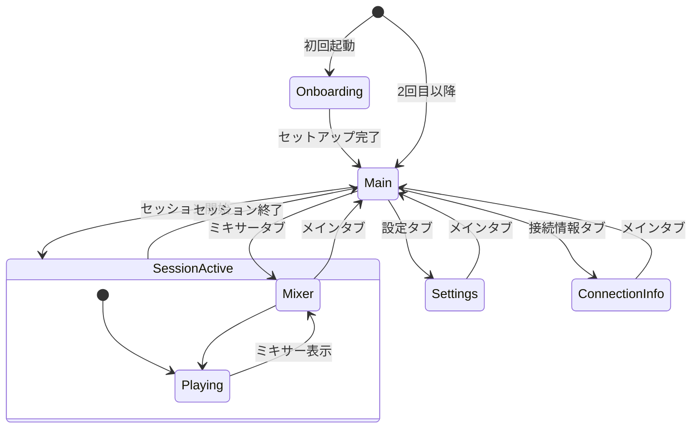
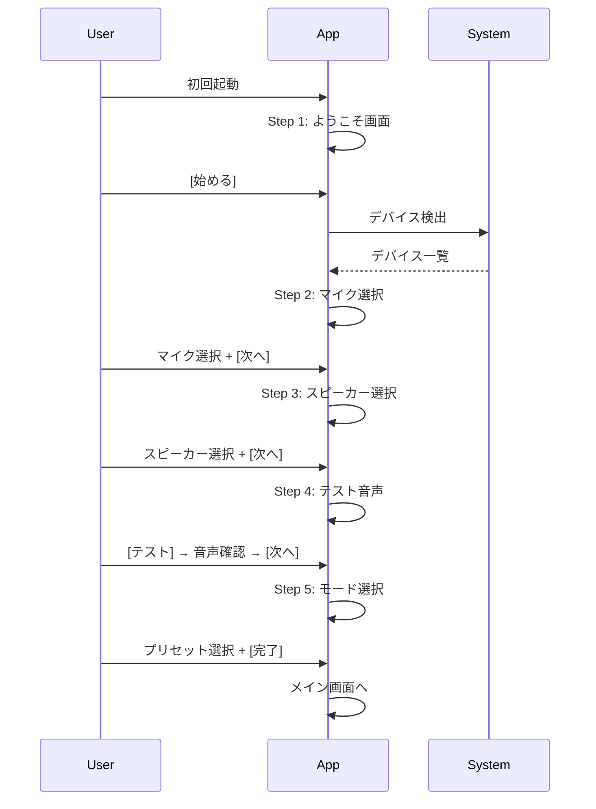

# jamjam UI/UX ガイドライン

Claude CodeがUI実装を迷わず進められるための実践的ガイドライン

---

## 1. 設計原則（優先順位付き）

以下の順序で設計判断を行う。上位が下位より優先される。

| 優先度 | 原則 | 説明 |
|--------|------|------|
| **1** | **低遅延の維持** | UI操作がオーディオ処理をブロックしない。UIスレッドとオーディオスレッドは完全分離 |
| **2** | **演奏中の安定性** | 演奏中にモーダル表示しない。自動設定切り替え禁止。ユーザーの意図しないUI変更を禁止 |
| **3** | **1クリック開始** | セッション開始まで最短3ステップ以内。プリセット選択のみで動作 |
| **4** | **専門用語の排除** | 一般ユーザーが理解できる言葉のみ。技術詳細は折りたたみの中 |
| **5** | **視線移動の最小化** | 重要情報は上部固定。演奏中に必要な情報は1画面に収める |
| **6** | **フレンドリーなデザイン** | 明るい色、丸み、親しみやすいアイコン。威圧的でない |

---

## 2. ターゲットユーザー

- **技術レベル**: 一般ユーザー（Zoom/Discordが使える程度）
- **前提知識**: 専門用語（ASIO、レイテンシー、ジッターバッファ等）を知らない
- **利用環境**: ヘッドフォン使用（スピーカー使用時はエコー警告を表示）

---

## 3. 用語ガイドライン

### 3.1 専門用語→平易な表現

| 専門用語 | 表示（日本語） | 表示（英語） | 使用場面 |
|---------|---------------|-------------|---------|
| Latency / RTT | 遅延 | Delay | ステータス、詳細設定 |
| Jitter | ゆらぎ / 不安定さ | Fluctuation | 詳細情報のみ |
| Jitter Buffer | バッファ | Buffer | 詳細設定のみ |
| Packet Loss | 接続の安定性 | Connection stability | 警告表示時 |
| Sample Rate | 音質（標準/高音質） | Quality | 設定画面 |
| Frame Size | 反応速度（速い/標準） | Responsiveness | 設定画面 |
| Codec | 圧縮方式 | Compression | 詳細設定のみ |
| PCM | 非圧縮 / 高音質 | Uncompressed | プリセット説明 |
| Opus | 圧縮 / 通常 | Compressed | プリセット説明 |
| FEC | エラー補正 | Error correction | 詳細設定のみ |
| DTLS | 暗号化 | Encryption | 詳細設定のみ |

### 3.2 禁止表現

- 「高速」「低遅延」「高品質」（数値や相対比較で表現する）
- 「エラーが発生しました」のみ（原因と対処法を必ず添える）
- 「不明なエラー」（具体的な状況を表示する）

### 3.3 プリセット表示名

| 内部名 | 日本語 | 英語 | 説明 |
|--------|--------|------|------|
| zero-latency | 最速モード | Fastest Mode | 光回線同士の演奏に |
| ultra-low-latency | 低遅延モード | Low Delay Mode | 安定した回線での演奏に |
| balanced | バランスモード | Balanced Mode | 通常のインターネット接続に最適 |
| high-quality | 高音質モード | High Quality Mode | 高速回線での録音向け |

---

## 4. 画面構成と情報階層

### 4.1 画面一覧

| 画面 | 用途 | 優先度 |
|------|------|--------|
| メイン | セッション参加/作成、基本操作 | 最高 |
| ミキサー | 参加者の音量調整 | 高 |
| 設定 | オーディオデバイス、プリセット | 中 |
| 接続情報 | 詳細なネットワーク統計 | 低 |
| オンボーディング | 初回セットアップ | 初回のみ |

### 4.2 情報階層

```
レベル1（常時表示）
├─ 接続状態アイコン（緑/黄/赤）
├─ 現在のモード名
└─ 基本操作ボタン（開始/終了）

レベル2（1クリックで表示）
├─ 参加者一覧
├─ 音量スライダー
└─ ミュートボタン

レベル3（設定画面）
├─ プリセット選択
├─ デバイス選択
└─ 言語/テーマ設定

レベル4（詳細設定 - 折りたたみ内）
├─ サンプルレート
├─ フレームサイズ
├─ コーデック選択
└─ 技術的な接続統計
```

### 4.3 画面遷移図



---

## 5. コンポーネント設計指針

### 5.1 接続状態インジケーター

| 状態 | 色 | アイコン | テキスト |
|------|-----|---------|---------|
| 未接続 | グレー | 空の円 | 未接続 |
| 接続中 | 黄（点滅） | 回転アイコン | 接続中... |
| 接続済み | 緑 | チェック | 接続中 |
| 不安定 | 黄 | 警告 | 不安定 |
| 切断 | 赤 | X | 切断されました |

### 5.2 ミキサーチャンネルストリップ

```
┌─────────────┐
│  名前/ラベル │
├─────────────┤
│ レベルメーター │
│  （縦型）    │
├─────────────┤
│ 音量フェーダー │
├─────────────┤
│ [M] [S] [P] │
│ ミュート/ソロ/Pan │
└─────────────┘

サイズ:
- Desktop: 幅 100px / 高さ 300px
- Mobile: 幅 80px / 高さ 250px
```

**操作仕様**:
- フェーダー: ドラッグで音量調整（0-100%）
- ダブルクリック: 100%にリセット
- ミュートボタン: トグル（アクティブ時は赤）
- ソロボタン: トグル（アクティブ時は黄）
- Panノブ: 左右パンニング（-100〜+100）

### 5.3 ボタンスタイル

| タイプ | 用途 | スタイル |
|--------|------|---------|
| プライマリ | 主要アクション | アクセントカラー背景、白テキスト、radius 8px |
| セカンダリ | 補助アクション | 透明背景、グレーボーダー |
| デンジャー | 破壊的アクション | 赤系背景、白テキスト |
| アイコン | コンパクト操作 | 32x32px、透明背景 |

### 5.4 プリセットセレクター

カード形式のラジオボタンで表示:

```
┌─────────────────────────────────────────────────┐
│ ○ 最速モード                          ★推奨    │
│   光回線同士の演奏に。遅延を最小限に            │
└─────────────────────────────────────────────────┘
┌─────────────────────────────────────────────────┐
│ ● バランスモード                               │
│   通常のインターネット接続に最適               │
└─────────────────────────────────────────────────┘
```

**推奨マーク表示基準**:

| ジッター | 推奨プリセット |
|---------|--------------|
| < 1ms | 最速モード |
| 1-3ms | 低遅延モード |
| 3-10ms | バランスモード |
| > 10ms | 高音質モード |

---

## 6. 状態管理とユーザーフィードバック

### 6.1 トースト通知

**位置**: 画面右下

| タイプ | 持続時間 | 閉じ方 |
|--------|---------|--------|
| 成功 | 3秒 | 自動 |
| 情報 | 4秒 | 自動 |
| 警告 | 5秒 | 手動ボタンあり |
| エラー | ∞ | 手動で閉じるまで |

**例**:
```
┌─────────────────────────────────────┐
│ ✓ セッションに参加しました           │
└─────────────────────────────────────┘

┌─────────────────────────────────────┐
│ ⚠ 接続が不安定です                  │
│   有線LANの使用をお勧めします        │
│                          [詳細] [×] │
└─────────────────────────────────────┘
```

### 6.2 ローディング状態

| アクション | 表示 | タイムアウト |
|-----------|------|------------|
| セッション作成 | ボタン内スピナー | 10秒 |
| セッション参加 | ボタン内スピナー | 15秒 |
| デバイス検出 | プログレスバー | 5秒 |
| オーディオ開始 | ボタン無効化 | 3秒 |

### 6.3 接続品質フィードバック

**ステータスバー（常時表示）**: `● 接続中（15ms）`

**詳細表示（接続情報画面）**:
```
┌─────────────────────────────────────┐
│ 接続品質: 良好 ●                    │
├─────────────────────────────────────┤
│ 遅延: 15ms                          │
│ 安定性: 非常に安定                  │
│ ✓ 最速モードが使えます              │
│                    [最速に切り替え]  │
└─────────────────────────────────────┘
```

### 6.4 インライン検証

```
招待コード
┌─────────────────────────────┐
│ ABC12X                      │ ← 赤ボーダー
└─────────────────────────────┘
  ⚠ 招待コードが見つかりません
```

---

## 7. Desktop / Mobile の差分

### 7.1 共通仕様

- 全機能を両プラットフォームで利用可能
- レスポンシブ設計（ブレークポイント: 768px）
- 同一のカラーパレット・デザイントークン

### 7.2 プラットフォーム別仕様

| 項目 | Desktop | Mobile |
|------|---------|--------|
| ナビゲーション | 横タブ（上部） | ボトムタブバー |
| ウィンドウサイズ | 最小 800x600px、推奨 1280x720px | 最小 320x568px |
| ミキサー | 横スクロール、最大10チャンネル表示 | 横スクロール + ページネーション |
| キーボード操作 | ショートカット対応 | なし |
| システム連携 | システムトレイ常駐（オプション） | バックグラウンド動作 |
| ジェスチャー | なし | スワイプでタブ切り替え |

### 7.3 レスポンシブレイアウト

**Desktop（>= 768px）**:
```
┌──────────────────────────────────────────────┐
│ ヘッダー                                     │
├──────────────────────────────────────────────┤
│ ┌──────────────┐ ┌──────────────────────────┐│
│ │ セッション    │ │ オーディオ設定          ││
│ │ パネル       │ │                          ││
│ └──────────────┘ └──────────────────────────┘│
│ ┌──────────────────────────────────────────┐│
│ │ ミキサー（横並び）                        ││
│ └──────────────────────────────────────────┘│
└──────────────────────────────────────────────┘
```

**Mobile（< 768px）**:
```
┌─────────────────────┐
│ ヘッダー（簡略化） │
├─────────────────────┤
│ セッションパネル    │
├─────────────────────┤
│ オーディオ設定      │
├─────────────────────┤
│ ミキサー            │
│ （横スクロール）    │
├─────────────────────┤
│ [メイン][ミキサー]  │
│ [設定][接続]        │
└─────────────────────┘
```

---

## 8. カラーパレットとデザイントークン

### 8.1 ダークモード

| トークン | 用途 | 値 |
|---------|------|-----|
| `--color-bg-primary` | 背景（メイン） | #1E1E2E |
| `--color-bg-secondary` | 背景（パネル） | #2A2A3E |
| `--color-bg-elevated` | カード、モーダル | #363652 |
| `--color-accent` | ボタン、リンク | #7C5CFF |
| `--color-accent-hover` | アクセント（ホバー） | #9B7FFF |
| `--color-success` | 成功 | #4ADE80 |
| `--color-warning` | 警告 | #FBBF24 |
| `--color-danger` | エラー | #F87171 |
| `--color-text-primary` | テキスト（主） | #FFFFFF |
| `--color-text-secondary` | テキスト（副） | #A0A0B0 |
| `--color-text-disabled` | テキスト（無効） | #606070 |
| `--color-border` | ボーダー | #404060 |
| `--color-border-focus` | フォーカスボーダー | #7C5CFF |

### 8.2 ライトモード

| トークン | 用途 | 値 |
|---------|------|-----|
| `--color-bg-primary` | 背景（メイン） | #FAFAFA |
| `--color-bg-secondary` | 背景（パネル） | #FFFFFF |
| `--color-bg-elevated` | カード、モーダル | #FFFFFF |
| `--color-accent` | ボタン、リンク | #6B4FE0 |
| `--color-accent-hover` | アクセント（ホバー） | #5A3FD0 |
| `--color-success` | 成功 | #22C55E |
| `--color-warning` | 警告 | #EAB308 |
| `--color-danger` | エラー | #EF4444 |
| `--color-text-primary` | テキスト（主） | #1A1A2E |
| `--color-text-secondary` | テキスト（副） | #6B6B80 |
| `--color-text-disabled` | テキスト（無効） | #A0A0B0 |
| `--color-border` | ボーダー | #E0E0E8 |
| `--color-border-focus` | フォーカスボーダー | #6B4FE0 |

### 8.3 タイポグラフィ

| トークン | サイズ | 太さ | 用途 |
|---------|--------|------|------|
| `--font-h1` | 24px | 700 | 画面タイトル |
| `--font-h2` | 18px | 600 | セクションタイトル |
| `--font-h3` | 16px | 600 | 小見出し |
| `--font-body` | 14px | 400 | 本文 |
| `--font-caption` | 12px | 400 | キャプション |
| `--font-mono` | 14px | 400 | コード、数値 |

**フォントファミリー**:
```css
--font-family-sans: -apple-system, BlinkMacSystemFont, 'Segoe UI', Roboto, 'Hiragino Sans', 'Noto Sans JP', sans-serif;
--font-family-mono: 'SF Mono', 'Fira Code', Consolas, monospace;
```

### 8.4 スペーシング

| トークン | 値 |
|---------|-----|
| `--space-xs` | 4px |
| `--space-sm` | 8px |
| `--space-md` | 16px |
| `--space-lg` | 24px |
| `--space-xl` | 32px |
| `--space-2xl` | 48px |

### 8.5 角丸

| トークン | 値 | 用途 |
|---------|-----|------|
| `--radius-sm` | 4px | 入力フィールド |
| `--radius-md` | 8px | カード、ボタン |
| `--radius-lg` | 12px | モーダル |
| `--radius-full` | 9999px | アイコンボタン、バッジ |

### 8.6 シャドウ

| トークン | 値 | 用途 |
|---------|-----|------|
| `--shadow-sm` | 0 1px 2px rgba(0,0,0,0.1) | 軽い浮き上がり |
| `--shadow-md` | 0 4px 6px rgba(0,0,0,0.15) | カード |
| `--shadow-lg` | 0 10px 15px rgba(0,0,0,0.2) | モーダル |

### 8.7 アニメーション

| トークン | 値 | 用途 |
|---------|-----|------|
| `--transition-fast` | 100ms ease-out | ホバー、アクティブ状態 |
| `--transition-normal` | 200ms ease-out | 画面遷移、展開 |
| `--transition-slow` | 300ms ease-out | モーダル表示 |

---

## 9. オンボーディングフロー

### 9.1 フロー概要



### 9.2 各ステップの内容

**Step 1: ようこそ**
```
┌─────────────────────────────────────┐
│                                     │
│          jamjam                     │
│                                     │
│    音楽仲間とオンラインで           │
│    一緒に演奏しよう                 │
│                                     │
│       [ 始める ]                    │
│                                     │
│    ・ マイクとスピーカーが必要です  │
│    ・ ヘッドフォンの使用をお勧めします │
│                                     │
└─────────────────────────────────────┘
```

**Step 2: マイク選択**
```
┌─────────────────────────────────────┐
│ ステップ 1/4                        │
│                                     │
│  マイクを選んでください             │
│                                     │
│  ┌─────────────────────────────┐   │
│  │ ○ 内蔵マイク               │   │
│  │ ● USB オーディオ （推奨）   │   │
│  │ ○ Bluetooth ヘッドセット    │   │
│  └─────────────────────────────┘   │
│                                     │
│  レベル: ████████░░░░░░░  良好      │
│                                     │
│     [戻る]              [次へ]      │
└─────────────────────────────────────┘
```

**Step 3: スピーカー選択**
```
┌─────────────────────────────────────┐
│ ステップ 2/4                        │
│                                     │
│  スピーカーを選んでください         │
│                                     │
│  ┌─────────────────────────────┐   │
│  │ ● ヘッドフォン （推奨）     │   │
│  │ ○ 内蔵スピーカー            │   │
│  │ ○ Bluetooth スピーカー      │   │
│  └─────────────────────────────┘   │
│                                     │
│  ⚠ スピーカー使用時はエコーが      │
│    発生する可能性があります         │
│                                     │
│     [戻る]              [次へ]      │
└─────────────────────────────────────┘
```

**Step 4: テスト**
```
┌─────────────────────────────────────┐
│ ステップ 3/4                        │
│                                     │
│  音声をテストしましょう             │
│                                     │
│  [テスト音を再生]                   │
│                                     │
│  音は聞こえましたか？               │
│  ┌─────────────────────────────┐   │
│  │ ● はい、聞こえました        │   │
│  │ ○ いいえ、聞こえません      │   │
│  └─────────────────────────────┘   │
│                                     │
│  聞こえない場合は、スピーカーの     │
│  音量を確認してください             │
│                                     │
│     [戻る]              [次へ]      │
└─────────────────────────────────────┘
```

**Step 5: モード選択**
```
┌─────────────────────────────────────┐
│ ステップ 4/4                        │
│                                     │
│  モードを選んでください             │
│                                     │
│  ┌─────────────────────────────┐   │
│  │ ● バランスモード（推奨）    │   │
│  │   通常のインターネット接続向け │   │
│  ├─────────────────────────────┤   │
│  │ ○ 最速モード               │   │
│  │   光回線同士の演奏向け       │   │
│  ├─────────────────────────────┤   │
│  │ ○ 高音質モード             │   │
│  │   録音向け                   │   │
│  └─────────────────────────────┘   │
│                                     │
│  後から設定で変更できます           │
│                                     │
│     [戻る]              [完了]      │
└─────────────────────────────────────┘
```

### 9.3 スキップオプション

- 各ステップに「スキップ」リンクを配置（控えめに）
- スキップ時はデフォルト値を使用
- 「後で設定」リンクで完全スキップも可能

---

## 10. エラーハンドリングとメッセージング

### 10.1 エラーメッセージフォーマット

```
[アイコン] タイトル（何が起きたか）
説明（なぜ起きたか + どうすればいいか）
[アクション] [詳細を見る]
```

### 10.2 エラーカタログ

| エラーコード | タイトル | 説明 | アクション |
|-------------|---------|------|-----------|
| `ERR_CONN_TIMEOUT` | 接続できませんでした | 相手に接続できませんでした。招待コードが正しいか確認してください。 | [再試行] |
| `ERR_CONN_REFUSED` | 接続が拒否されました | 相手がセッションを終了した可能性があります。 | [OK] |
| `ERR_CONN_UNSTABLE` | 接続が不安定です | インターネット接続が不安定です。有線LANの使用をお勧めします。 | [設定を変更] |
| `ERR_AUDIO_DEVICE` | マイクが使えません | マイクにアクセスできません。他のアプリが使用中の可能性があります。 | [デバイスを変更] |
| `ERR_AUDIO_OUTPUT` | スピーカーが使えません | スピーカーにアクセスできません。 | [デバイスを変更] |
| `ERR_SESSION_FULL` | セッションがいっぱいです | 参加者数の上限に達しています。 | [OK] |
| `ERR_NETWORK_NAT` | 直接接続できません | NAT越えに失敗しました。ルーターの設定を確認してください。 | [詳細を見る] |

### 10.3 警告メッセージ

| 状況 | メッセージ | 表示方法 |
|------|-----------|---------|
| WiFi使用検出 | 有線LANの使用をお勧めします。WiFiでは遅延が大きくなることがあります。 | トースト（警告） |
| 高ジッター | 接続が不安定です。モードを「バランス」に切り替えることをお勧めします。 | バナー |
| パケットロス > 2% | 接続品質が低下しています。 | ステータスアイコン変化 |
| バッテリー低下（Mobile） | バッテリーが少なくなっています。充電しながらの使用をお勧めします。 | トースト |

### 10.4 技術詳細の表示

「詳細を見る」ボタンを押した場合のみ表示:

```
┌─────────────────────────────────────┐
│ ❌ 接続できませんでした             │
│    相手に接続できませんでした。     │
│    招待コードが正しいか確認して     │
│    ください。                        │
│                                     │
│  ▼ 技術的な詳細                     │
│  ┌─────────────────────────────┐   │
│  │ Error: Connection timeout   │   │
│  │ Code: ERR_CONN_TIMEOUT      │   │
│  │ Target: 192.168.1.50:5000   │   │
│  │ Elapsed: 15.2s               │   │
│  │ NAT Type: Symmetric          │   │
│  └─────────────────────────────┘   │
│                                     │
│    [コピー]  [再試行]  [閉じる]     │
└─────────────────────────────────────┘
```

---

## 11. アクセシビリティ要件

### 11.1 必須要件

| 項目 | 要件 |
|------|------|
| キーボード操作 | 全機能をキーボードのみで操作可能 |
| フォーカス表示 | フォーカス状態を明確に表示（2px以上のアウトライン） |
| コントラスト比 | WCAG AA準拠（通常テキスト 4.5:1、大きいテキスト 3:1） |
| スクリーンリーダー | 主要機能でaria-labelを提供 |
| モーション | prefers-reduced-motionを尊重 |

### 11.2 キーボードショートカット

| ショートカット | アクション |
|---------------|-----------|
| `Tab` / `Shift+Tab` | フォーカス移動 |
| `Enter` / `Space` | ボタン押下、選択 |
| `Escape` | モーダルを閉じる、キャンセル |
| `Ctrl/Cmd + M` | 自分をミュート/ミュート解除 |
| `Ctrl/Cmd + 1-4` | タブ切り替え |
| `Ctrl/Cmd + ,` | 設定を開く |

### 11.3 スクリーンリーダー対応

```html
<!-- 接続状態 -->
<div role="status" aria-live="polite" aria-label="接続状態: 接続中、遅延15ミリ秒">
  ● 接続中（15ms）
</div>

<!-- ミュートボタン -->
<button aria-label="自分をミュート" aria-pressed="false">
  M
</button>

<!-- 音量スライダー -->
<input type="range"
       aria-label="音量"
       aria-valuemin="0"
       aria-valuemax="100"
       aria-valuenow="80"
       aria-valuetext="80パーセント">
```

### 11.4 色覚多様性対応

- 色だけで情報を伝えない（アイコン、テキストを併用）
- 成功/警告/エラーは色に加えてアイコンで区別
- 色覚シミュレーションでテスト必須

---

## 12. 翻訳キー（i18n）

以下のキーを `ui/locales/ja.json` および `ui/locales/en.json` に追加する:

```json
{
  "onboarding": {
    "welcome": {
      "title": "ようこそ",
      "subtitle": "音楽仲間とオンラインで一緒に演奏しよう",
      "start": "始める",
      "headphoneNote": "ヘッドフォンの使用をお勧めします"
    },
    "mic": {
      "title": "マイクを選んでください",
      "level": "レベル",
      "good": "良好"
    },
    "speaker": {
      "title": "スピーカーを選んでください",
      "echoWarning": "スピーカー使用時はエコーが発生する可能性があります"
    },
    "test": {
      "title": "音声をテストしましょう",
      "playTest": "テスト音を再生",
      "heard": "音は聞こえましたか？",
      "yes": "はい、聞こえました",
      "no": "いいえ、聞こえません",
      "volumeHint": "聞こえない場合は、スピーカーの音量を確認してください"
    },
    "mode": {
      "title": "モードを選んでください",
      "changeLater": "後から設定で変更できます"
    },
    "nav": {
      "back": "戻る",
      "next": "次へ",
      "skip": "スキップ",
      "done": "完了"
    }
  },
  "presets": {
    "zeroLatency": {
      "name": "最速モード",
      "description": "光回線同士の演奏に。遅延を最小限に"
    },
    "ultraLowLatency": {
      "name": "低遅延モード",
      "description": "安定した回線での演奏に"
    },
    "balanced": {
      "name": "バランスモード",
      "description": "通常のインターネット接続に最適"
    },
    "highQuality": {
      "name": "高音質モード",
      "description": "高速回線での録音向け"
    }
  },
  "quality": {
    "veryStable": "非常に安定",
    "stable": "安定",
    "unstable": "やや不安定",
    "veryUnstable": "不安定",
    "recommendation": "「{preset}」モードをお勧めします",
    "switchTo": "{preset}に切り替え"
  },
  "errors": {
    "connectionTimeout": {
      "title": "接続できませんでした",
      "description": "相手に接続できませんでした。招待コードが正しいか確認してください。"
    },
    "connectionRefused": {
      "title": "接続が拒否されました",
      "description": "相手がセッションを終了した可能性があります。"
    },
    "connectionUnstable": {
      "title": "接続が不安定です",
      "description": "インターネット接続が不安定です。有線LANの使用をお勧めします。"
    },
    "audioDevice": {
      "title": "マイクが使えません",
      "description": "マイクにアクセスできません。他のアプリが使用中の可能性があります。"
    },
    "retry": "再試行",
    "changeDevice": "デバイスを変更",
    "viewDetails": "詳細を見る"
  },
  "warnings": {
    "wifiDetected": "有線LANの使用をお勧めします。WiFiでは遅延が大きくなることがあります。",
    "highJitter": "接続が不安定です。モードを「バランス」に切り替えることをお勧めします。",
    "batteryLow": "バッテリーが少なくなっています。充電しながらの使用をお勧めします。"
  },
  "theme": {
    "title": "テーマ",
    "light": "ライト",
    "dark": "ダーク",
    "system": "システム設定に従う"
  }
}
```

---

## 13. 実装チェックリスト

### 実装対象ファイル

| ファイル | 変更内容 |
|---------|---------|
| `ui/src/styles.css` | カラーパレット、デザイントークン適用 |
| `ui/locales/ja.json` | 用語変更、新規キー追加 |
| `ui/locales/en.json` | 用語変更、新規キー追加 |
| `ui/src/main.ts` | オンボーディング、エラーハンドリング実装 |

### 検証項目

- [ ] オンボーディング: 初回起動から5ステップで完了できる
- [ ] レスポンシブ: 768px以下でボトムナビに切り替わる
- [ ] アクセシビリティ: キーボードのみで全操作可能
- [ ] エラー表示: 各エラー状態でユーザーフレンドリーなメッセージが表示される
- [ ] カラーモード: ライト/ダーク/システム追従が正しく動作する
- [ ] 用語: 専門用語が平易な表現に置き換えられている
- [ ] トースト: 各タイプで適切な持続時間と閉じ方が機能する
