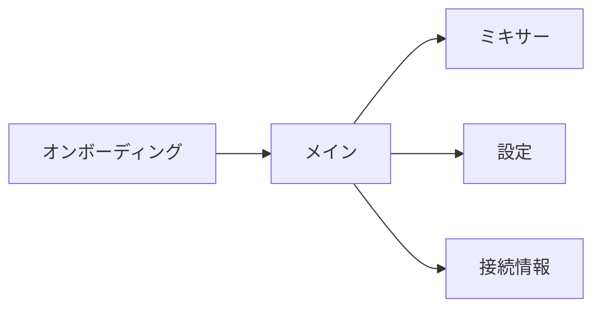

# jamjam UI 仕様書

Claude Code が UI 実装を効率的に進めるための仕様書インデックス。

> **Note**: このディレクトリは `ui-ux-guideline.md` を補完する。
> 既存の ui-ux-guideline.md は設計原則・用語・コンポーネント設計の概要を含む。
> このディレクトリでは、実装に必要な詳細仕様を提供する。

---

## ドキュメント構成

```
docs-spec/ui/
├── README.md                 # このファイル
├── personas.md               # ユーザーペルソナ（詳細シナリオ付き）
├── user-stories.md           # ユーザーストーリー（Epic/Story形式）
├── design-tokens.md          # デザイントークン（CSS変数）
├── i18n-strategy.md          # 国際化戦略
├── components/               # コンポーネント仕様
│   ├── README.md             # コンポーネントカタログ
│   └── connection-indicator.md
└── screens/                  # 画面仕様
    └── README.md             # 画面遷移図
```

---

## クイックリファレンス

### ペルソナ

| ペルソナ | 代表的ユースケース | 技術レベル |
|---------|-------------------|-----------|
| 山田太郎 | バンド練習 | 一般ユーザー |
| 鈴木花子 | 音楽レッスン | PC苦手 |
| 田中一郎 | プロセッション | 上級者 |

詳細: [personas.md](./personas.md)

### 設計判断の優先順位

1. **低遅延の維持** - UI がオーディオをブロックしない
2. **演奏中の安定性** - モーダル禁止、自動切り替え禁止
3. **1クリック開始** - 3ステップ以内でセッション開始
4. **専門用語の排除** - 一般ユーザーが理解できる言葉
5. **視線移動の最小化** - 重要情報は上部固定
6. **フレンドリーなデザイン** - 明るい色、丸み

詳細: [../ui-ux-guideline.md](../ui-ux-guideline.md) Section 1

### 画面構成



詳細: [screens/README.md](./screens/README.md)

### デザイントークン

スタイリングは CSS Custom Properties（CSS変数）を使用。

```css
/* 使用例 */
.button {
  background: var(--color-accent);
  border-radius: var(--radius-md);
  padding: var(--space-sm) var(--space-md);
}
```

詳細: [design-tokens.md](./design-tokens.md)

---

## 関連ドキュメント

| ドキュメント | 役割 |
|-------------|------|
| [ui-ux-guideline.md](../ui-ux-guideline.md) | 設計原則、用語、コンポーネント概要 |
| [architecture.md](../architecture.md) Section 8 | GUI フレームワーク決定 |
| [ADR-004](../adr/ADR-004-gui-framework.md) | Tauri 採用理由 |
| [ADR-007](../adr/ADR-007-i18n-library.md) | i18next 採用理由 |
| [ADR-008](../adr/ADR-008-zero-latency-mode.md) | ゼロレイテンシーモード |

---

## 実装時の注意事項

1. **ペルソナ「鈴木花子」を基準に設計する** - 最も技術に不慣れなユーザーで検証
2. **CSS変数は `ui/src/styles/tokens.css` に配置**
3. **i18n キーは `ui/locales/{ja,en}.json` に配置**
4. **コンポーネント実装前に対応する仕様書を確認**
