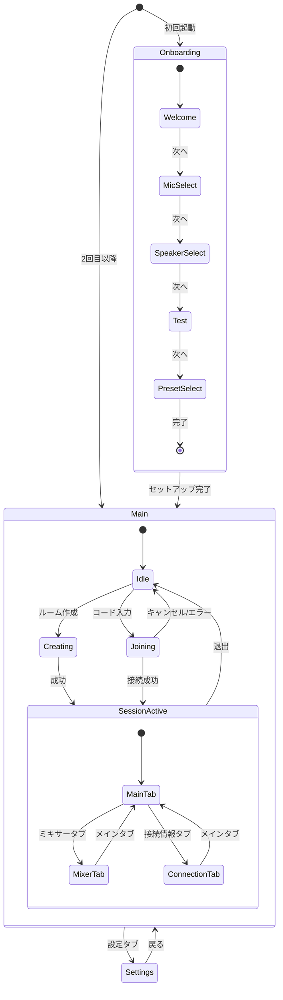
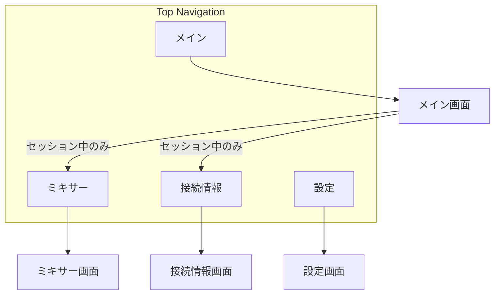

# 画面仕様

jamjam の画面構成と遷移を定義する。

> **関連**: [../user-stories.md](../user-stories.md)

---

## 画面一覧

| 画面 | 用途 | 優先度 |
|------|------|--------|
| メイン | セッション参加/作成、基本操作 | 最高 |
| ミキサー | 参加者の音量調整 | 高 |
| 設定 | オーディオデバイス、プリセット | 中 |
| 接続情報 | 詳細なネットワーク統計 | 低 |
| オンボーディング | 初回セットアップ | 初回のみ |

---

## 画面遷移図

### 全体フロー



### ナビゲーション構造



---

## 画面詳細

### メイン画面（Main）

**役割**: セッション開始/参加の入口、接続状態表示

#### レイアウト

```
┌──────────────────────────────────────────┐
│  [ロゴ]  jamjam              [⚙ 設定]   │  ← ヘッダー
├──────────────────────────────────────────┤
│                                          │
│         ● 未接続                         │  ← 接続状態
│                                          │
│    ┌────────────────────────────────┐    │
│    │                                │    │
│    │  [ ルームを作成 ]              │    │  ← プライマリCTA
│    │                                │    │
│    │  ─────── または ───────        │    │
│    │                                │    │
│    │  招待コード: [______]          │    │  ← コード入力
│    │              [ 参加 ]          │    │
│    │                                │    │
│    └────────────────────────────────┘    │
│                                          │
│    現在のモード: バランスモード          │  ← 現在の設定
│                                          │
└──────────────────────────────────────────┘
```

#### セッション中レイアウト

```
┌──────────────────────────────────────────┐
│  [メイン] [ミキサー] [接続情報]  [⚙]    │  ← タブナビゲーション
├──────────────────────────────────────────┤
│                                          │
│    ● 接続中 (15ms)                       │  ← 接続状態 + 遅延
│                                          │
│    ルーム: ABC123                        │
│    参加者: 3名                           │
│                                          │
│    ┌──────────────────────────────┐      │
│    │ 👤 自分        [🔇 ミュート] │      │  ← 自分のコントロール
│    │ 👤 健太                      │      │
│    │ 👤 美咲                      │      │
│    └──────────────────────────────┘      │
│                                          │
│    招待: [ABC123 📋] [URL 📋]            │  ← 招待情報
│                                          │
│    [ 退出 ]                              │  ← 退出ボタン
│                                          │
└──────────────────────────────────────────┘
```

#### 状態

| 状態 | 表示内容 |
|-----|---------|
| 未接続 | ルーム作成/参加フォーム |
| 接続中 | ローディングスピナー |
| 接続済み | セッション情報、参加者一覧 |
| エラー | エラーメッセージ + 再試行ボタン |

---

### ミキサー画面（Mixer）

**役割**: 参加者ごとの音量調整

#### レイアウト

```
┌──────────────────────────────────────────┐
│  [メイン] [ミキサー] [接続情報]  [⚙]    │
├──────────────────────────────────────────┤
│                                          │
│  ┌────┐  ┌────┐  ┌────┐  ┌────┐         │
│  │自分│  │健太│  │美咲│  │    │         │
│  ├────┤  ├────┤  ├────┤  ├────┤         │
│  │▓▓▓▓│  │▓▓▓░│  │▓▓░░│  │    │         │  ← レベルメーター
│  │    │  │    │  │    │  │    │         │
│  │ ▌  │  │ ▌  │  │ ▌  │  │    │         │  ← 音量フェーダー
│  │ ▌  │  │▌   │  │  ▌ │  │    │         │
│  │    │  │    │  │    │  │    │         │
│  │80% │  │65% │  │75% │  │    │         │
│  ├────┤  ├────┤  ├────┤  ├────┤         │
│  │[M] │  │[M] │  │[M] │  │    │         │  ← ミュートボタン
│  └────┘  └────┘  └────┘  └────┘         │
│                                          │
│  マスター: ─────●───── 85%              │  ← マスター音量
│                                          │
└──────────────────────────────────────────┘
```

#### コンポーネント

- チャンネルストリップ × 参加者数
- マスター音量スライダー
- 全ミュート解除ボタン

---

### 設定画面（Settings）

**役割**: オーディオ設定、プリセット選択

#### レイアウト

```
┌──────────────────────────────────────────┐
│  ← 設定                                  │
├──────────────────────────────────────────┤
│                                          │
│  ■ オーディオデバイス                    │
│  ─────────────────────────────────────── │
│  入力: [Built-in Microphone      ▼]     │
│  出力: [Built-in Speakers        ▼]     │
│                                          │
│  ■ モード設定                            │
│  ─────────────────────────────────────── │
│  ○ 最速モード                            │
│  ● バランスモード（推奨）                │
│  ○ 高音質モード                          │
│                                          │
│  ▶ 詳細設定                              │  ← 折りたたみ
│                                          │
│  ■ 表示                                  │
│  ─────────────────────────────────────── │
│  言語: [日本語               ▼]         │
│  テーマ: [ダーク             ▼]         │
│                                          │
└──────────────────────────────────────────┘
```

#### 詳細設定（展開時）

```
│  ▼ 詳細設定                              │
│  ─────────────────────────────────────── │
│  サンプルレート: [48000 Hz       ▼]     │
│  フレームサイズ: [64 samples     ▼]     │
│  コーデック: [PCM 32-bit float   ▼]     │
│  Jitterバッファ: [適応的         ▼]     │
│  FEC: [● 有効]                           │
```

---

### 接続情報画面（Connection）

**役割**: 詳細なネットワーク統計表示

#### レイアウト

```
┌──────────────────────────────────────────┐
│  [メイン] [ミキサー] [接続情報]  [⚙]    │
├──────────────────────────────────────────┤
│                                          │
│  ■ 全体状況                              │
│  ─────────────────────────────────────── │
│  接続品質: 🟢 良好                       │
│  推奨: zero-latencyモードに切り替え可能  │
│        [ zero-latencyに切り替え ]        │
│                                          │
│  ■ 参加者別                              │
│  ─────────────────────────────────────── │
│                                          │
│  健太                                    │
│  ├─ RTT: 15ms                            │
│  ├─ Jitter: 0.8ms                        │
│  ├─ Packet Loss: 0.1%                    │
│  └─ 推定遅延: 12ms                       │
│                                          │
│  美咲                                    │
│  ├─ RTT: 25ms                            │
│  ├─ Jitter: 2.1ms                        │
│  ├─ Packet Loss: 0.3%                    │
│  └─ 推定遅延: 18ms                       │
│                                          │
│  ■ オーディオデバイス                    │
│  ─────────────────────────────────────── │
│  入力遅延: 3ms                           │
│  出力遅延: 3ms                           │
│                                          │
└──────────────────────────────────────────┘
```

---

### オンボーディング画面

**役割**: 初回セットアップガイド

#### 共通レイアウト

```
┌──────────────────────────────────────────┐
│                                          │
│  ● ● ○ ○ ○                               │  ← 進捗インジケーター
│                                          │
│  ┌────────────────────────────────┐      │
│  │                                │      │
│  │      [ ステップ内容 ]          │      │
│  │                                │      │
│  └────────────────────────────────┘      │
│                                          │
│  [← 戻る]              [次へ →]         │
│                                          │
│        または [後で設定する]             │
│                                          │
└──────────────────────────────────────────┘
```

#### ステップ詳細

| ステップ | 内容 |
|---------|------|
| 1. ようこそ | アプリ紹介、前提条件（ヘッドフォン推奨）|
| 2. マイク選択 | デバイス一覧、レベルメーター |
| 3. スピーカー選択 | デバイス一覧、テスト音再生 |
| 4. テスト | マイクテスト（録音→再生）|
| 5. モード選択 | プリセット4種から選択 |

---

## レスポンシブ対応

### ブレークポイント

| サイズ | 幅 | ナビゲーション |
|-------|-----|---------------|
| Desktop | >= 768px | 上部水平タブ |
| Mobile | < 768px | 下部タブバー |

### モバイルレイアウト

```
┌─────────────────────┐
│  jamjam     [⚙]    │
├─────────────────────┤
│                     │
│   [ コンテンツ ]    │
│                     │
├─────────────────────┤
│ [🏠] [🎚] [📊] [⚙] │  ← ボトムナビ
└─────────────────────┘
```

---

## アクセシビリティ

### キーボード操作

| キー | 動作 |
|-----|------|
| Tab | フォーカス移動 |
| Enter / Space | ボタン押下 |
| Escape | モーダル閉じる |
| Ctrl/Cmd + 1-4 | タブ切り替え |
| Ctrl/Cmd + M | ミュート切り替え |

### フォーカス順序

1. ヘッダー（ロゴ、設定ボタン）
2. メインコンテンツ（上から下）
3. アクションボタン
4. ナビゲーション
