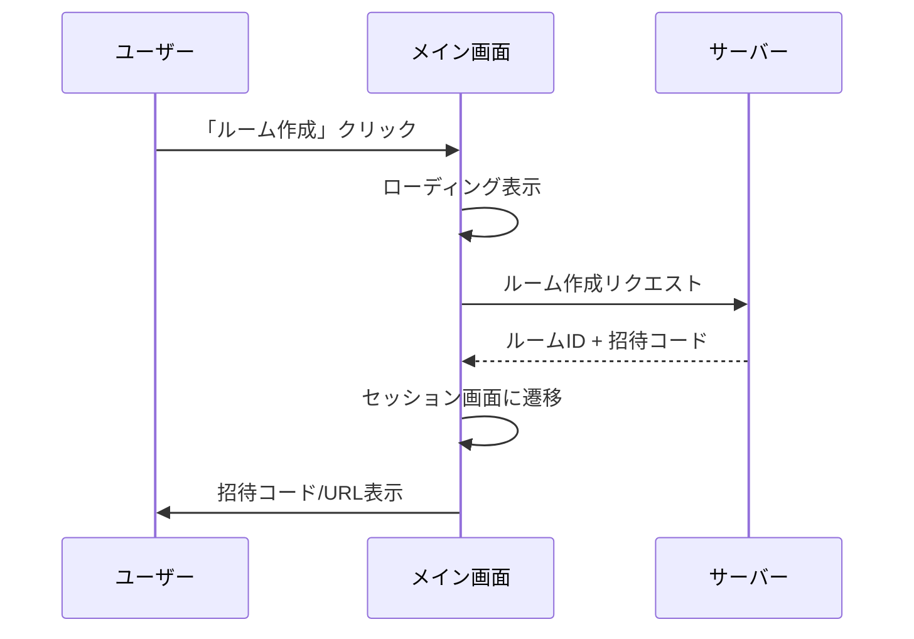

# ユーザーストーリー

jamjam の機能要件を Epic / User Story 形式で整理。
BDD 仕様（`behavior/*.feature`）と連携する。

> **参照ペルソナ**: [personas.md](./personas.md)

---

## Epic 1: セッション接続

**目標**: ユーザーが簡単にセッションを開始・参加できる

### US-1.1: ルームを作成する（P0）

**As** 山田太郎（アマチュアバンドメンバー）
**I want** ワンクリックでルームを作成できる
**So that** 友人をすぐに招待できる

#### 受入条件

- [ ] メイン画面に「ルーム作成」ボタンがある
- [ ] ボタンクリック後、10秒以内にルームが作成される
- [ ] 6文字の招待コード（大文字英数字）が表示される
- [ ] 招待URL（`jamjam://join/{code}`）が表示される
- [ ] 「コピー」ボタンで招待コード/URLをクリップボードにコピー
- [ ] ルーム作成後、自動的にホストとして参加

#### UIフロー



#### 関連

- BDD: `connection.feature` "ルームを作成する"
- ペルソナ: 山田太郎「10分以内に接続」

---

### US-1.2: 招待コードで参加する（P0）

**As** 鈴木花子（音楽講師）
**I want** 生徒から送られたコードを入力するだけで参加できる
**So that** 難しい設定なしにレッスンを始められる

#### 受入条件

- [ ] メイン画面に「参加」ボタンがある
- [ ] 6文字の招待コード入力フィールドがある
- [ ] 自動的に大文字に変換される
- [ ] 入力完了（6文字）で自動的に接続開始
- [ ] または「参加」ボタンで接続開始
- [ ] 接続成功後、セッション画面に遷移

#### エラーケース

| エラー | 表示メッセージ | アクション |
|-------|--------------|-----------|
| コード不正 | ルームが見つかりません | 再入力を促す |
| ルーム満員 | ルームが満員です | [OK] で閉じる |
| タイムアウト | 接続できませんでした | [再試行] ボタン |

#### 関連

- BDD: `connection.feature` "招待コードでルームに参加する"
- ペルソナ: 鈴木花子「ボタン1つで開始」

---

### US-1.3: 招待URLで参加する（P0）

**As** 山田太郎
**I want** 友人から送られたURLをクリックするだけで参加できる
**So that** 手動でコードを入力する手間を省ける

#### 受入条件

- [ ] `jamjam://join/{code}` 形式のURLを処理
- [ ] アプリ起動時にURL引数を確認
- [ ] 自動的に接続を開始
- [ ] パスワード付きの場合はパスワード入力画面を表示

#### 関連

- BDD: `connection.feature` "招待URLでルームに参加する"

---

### US-1.4: セッションから退出する（P0）

**As** すべてのユーザー
**I want** いつでもセッションから退出できる
**So that** 自分の意志でセッションを終了できる

#### 受入条件

- [ ] セッション中に「退出」ボタンが表示される
- [ ] クリックで即座に切断
- [ ] メイン画面に戻る
- [ ] 他の参加者に退出が通知される

#### 関連

- BDD: `connection.feature` "セッションから退出する"

---

## Epic 2: 音声コントロール

**目標**: ユーザーが直感的に音声を管理できる

### US-2.1: 参加者の音量を調整する（P0）

**As** 山田太郎
**I want** 各参加者の音量を個別に調整できる
**So that** バランスの良いミックスでセッションできる

#### 受入条件

- [ ] ミキサー画面に参加者ごとのチャンネルがある
- [ ] 縦型フェーダーで音量調整（0% - 100%）
- [ ] ドラッグで連続的に調整可能
- [ ] 現在の音量が数値で表示される
- [ ] デフォルト音量は 80%

#### UIコンポーネント

```
┌─────────────┐
│  太郎       │  ← 参加者名
├─────────────┤
│ ▓▓▓▓▓▓░░░░ │  ← レベルメーター
│             │
│    ┃┃       │  ← 音量フェーダー
│    ┃┃       │
│    ▼▼       │
│             │
│   80%       │  ← 音量値
├─────────────┤
│  [M] [S]    │  ← ミュート/ソロ
└─────────────┘
```

#### 関連

- BDD: なし（UI固有）
- コンポーネント: [mixer-channel.md](./components/mixer-channel.md)

---

### US-2.2: 自分をミュートする（P0）

**As** すべてのユーザー
**I want** ワンクリックで自分をミュートできる
**So that** 必要なときだけ音声を送信できる

#### 受入条件

- [ ] メイン画面に自分のミュートボタンがある
- [ ] クリックでミュート ON/OFF 切り替え
- [ ] ミュート中は赤色で表示
- [ ] キーボードショートカット: `Ctrl/Cmd + M`
- [ ] ミュート状態は他の参加者にも表示される

#### 関連

- アクセシビリティ: キーボード操作必須

---

### US-2.3: 他の参加者をミュートする（P1）

**As** 田中一郎
**I want** 特定の参加者の音声をミュートできる
**So that** ノイズ源を一時的に消せる

#### 受入条件

- [ ] ミキサーの各チャンネルに「M」ボタン
- [ ] ローカルミュート（自分だけに影響）
- [ ] ミュート中は赤色で表示
- [ ] 相手には通知されない

---

## Epic 3: レイテンシー最適化

**目標**: ユーザーが最適な遅延設定を簡単に選択できる

### US-3.1: プリセットを選択する（P0）

**As** 山田太郎
**I want** プリセットを選ぶだけで最適な設定になる
**So that** 技術的な知識なしに使える

#### 受入条件

- [ ] 設定画面にプリセット選択がある
- [ ] 4つのプリセットが選択可能:
  | プリセット | 表示名（日本語） |
  |-----------|---------------|
  | zero-latency | 最速モード |
  | ultra-low-latency | 低遅延モード |
  | balanced | バランスモード |
  | high-quality | 高音質モード |
- [ ] 各プリセットに簡潔な説明文
- [ ] デフォルトは「バランスモード」

#### UIコンポーネント

```
┌─────────────────────────────────┐
│ ○ 最速モード                    │
│   光回線同士の演奏に最適        │
├─────────────────────────────────┤
│ ○ 低遅延モード                  │
│   安定した回線での演奏に        │
├─────────────────────────────────┤
│ ● バランスモード（推奨）        │
│   通常のインターネット接続に    │
├─────────────────────────────────┤
│ ○ 高音質モード                  │
│   高速回線での録音向け          │
└─────────────────────────────────┘
```

#### 関連

- BDD: `latency.feature` "推奨に従ってプリセットを切り替える"
- ADR: ADR-008 Zero-Latency Mode

---

### US-3.2: 遅延情報を確認する（P1）

**As** 田中一郎
**I want** RTT、ジッター、パケットロスを数値で見たい
**So that** ネットワーク状態を把握して設定を最適化できる

#### 受入条件

- [ ] 接続情報画面に詳細な統計を表示
- [ ] 1秒ごとに更新
- [ ] 以下の情報を表示:
  | 項目 | 単位 | 例 |
  |-----|------|-----|
  | RTT | ms | 15ms |
  | Jitter | ms | 0.8ms |
  | Packet Loss | % | 0.1% |
  | 総遅延 | ms | 12ms |

#### 関連

- BDD: `latency.feature` "遅延情報を表示する"
- ペルソナ: 田中一郎「遅延を数値で確認」

---

### US-3.3: 推奨設定を受け入れる（P1）

**As** 山田太郎
**I want** アプリが推奨する設定に簡単に変更できる
**So that** 最適な設定を自分で判断しなくていい

#### 受入条件

- [ ] ジッターに基づいて推奨プリセットを表示
- [ ] 「○○モード推奨」のバッジ表示
- [ ] ワンクリックで推奨設定に切り替え
- [ ] 切り替え後「設定を変更しました」と通知

#### 推奨ロジック

| ジッター | 推奨プリセット |
|---------|--------------|
| < 1ms | zero-latency |
| 1-3ms | ultra-low-latency |
| 3-10ms | balanced |
| > 10ms | high-quality |

#### 関連

- BDD: `latency.feature` "ジッターが小さい場合にzero-latencyを推奨する"

---

## Epic 4: オンボーディング

**目標**: 初回ユーザーがスムーズにアプリを使い始められる

### US-4.1: 初回セットアップを完了する（P2）

**As** 鈴木花子
**I want** 案内に従うだけで初期設定が完了する
**So that** 技術的な知識なしに使い始められる

#### 受入条件

- [ ] 初回起動時にオンボーディング画面を表示
- [ ] 5ステップ以内で完了:
  1. ようこそ（アプリ紹介）
  2. マイク選択（レベルメーター表示）
  3. スピーカー選択（テスト音再生）
  4. テスト確認
  5. モード選択（プリセット）
- [ ] 各ステップに「次へ」「戻る」ボタン
- [ ] スキップ可能（「後で設定」）
- [ ] 設定完了後、メイン画面へ

#### 関連

- ペルソナ: 鈴木花子「設定画面を見ると不安になる」

---

### US-4.2: マイクを選択する（P2）

**As** 鈴木花子
**I want** 使用可能なマイクから選択できる
**So that** 正しいマイクで音声を送信できる

#### 受入条件

- [ ] 検出されたマイク一覧を表示
- [ ] 選択中のマイクのレベルメーターを表示
- [ ] 音声が入力されていることを視覚的に確認
- [ ] 「テスト」ボタンで録音→再生

---

## Epic 5: エラー処理

**目標**: ユーザーがエラー発生時も適切に対処できる

### US-5.1: 接続エラーを理解する（P1）

**As** 鈴木花子
**I want** エラーが発生したとき、日本語で対処法を教えてほしい
**So that** 何をすればいいかわかる

#### 受入条件

- [ ] すべてのエラーメッセージは日本語
- [ ] エラーには対処法を含める
- [ ] エラー表示形式:
  ```
  [アイコン] タイトル
  説明文（なぜ起きたか + どうすればいいか）
  [アクションボタン]
  ```

#### エラーカタログ

| コード | タイトル | 説明 | アクション |
|-------|---------|------|----------|
| ERR_CONN_TIMEOUT | 接続できませんでした | 相手が見つかりません。招待コードを確認してください | [再試行] |
| ERR_CONN_REFUSED | 接続が拒否されました | ルームが存在しないか、終了しています | [OK] |
| ERR_AUDIO_DEVICE | マイクが使えません | 他のアプリがマイクを使用中かもしれません | [デバイスを変更] |
| ERR_NETWORK_LOST | 接続が切れました | ネットワークを確認してください | [再接続] |

#### 関連

- ペルソナ: 鈴木花子「エラーが出ると何もできない」
- BDD: `connection.feature` エラー系シナリオ

---

## 優先順位サマリー

| 優先度 | ストーリー | ペルソナ |
|--------|-----------|---------|
| P0 | US-1.1 ルーム作成 | 山田 |
| P0 | US-1.2 招待コード参加 | 鈴木 |
| P0 | US-1.3 招待URL参加 | 山田 |
| P0 | US-1.4 退出 | 全員 |
| P0 | US-2.1 音量調整 | 山田 |
| P0 | US-2.2 自分をミュート | 全員 |
| P0 | US-3.1 プリセット選択 | 山田 |
| P1 | US-2.3 他者ミュート | 田中 |
| P1 | US-3.2 遅延情報確認 | 田中 |
| P1 | US-3.3 推奨設定 | 山田 |
| P1 | US-5.1 エラー処理 | 鈴木 |
| P2 | US-4.1 オンボーディング | 鈴木 |
| P2 | US-4.2 マイク選択 | 鈴木 |
