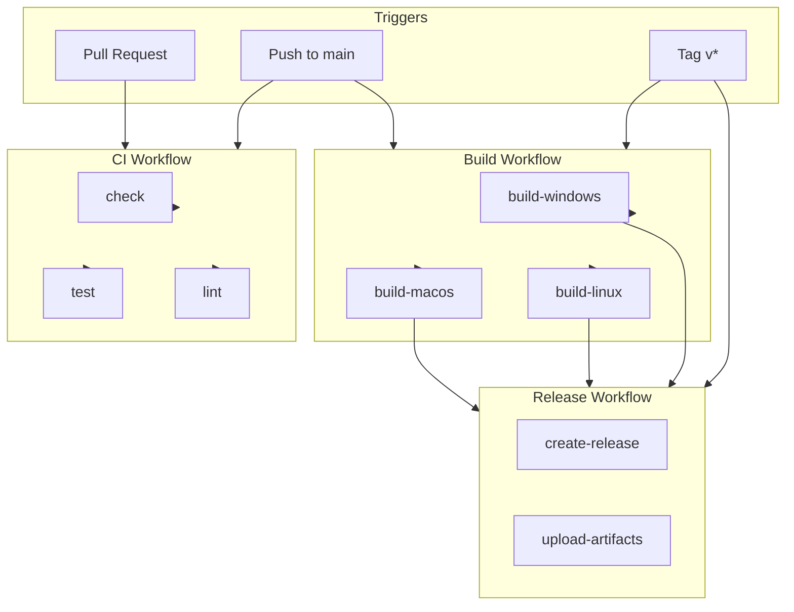
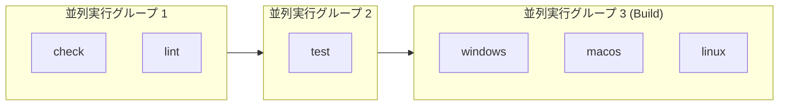

# ci.md

jamjam の CI/CD パイプラインを定義する。本ドキュメントは CI 実装の正とする。

---

## 1. 概要

### 1.1 目的

- コード品質の自動検証（コンパイル、テスト、lint）
- マルチプラットフォームビルドの自動化
- リリース成果物の自動生成

### 1.2 CI プラットフォーム

GitHub Actions を使用する。

---

## 2. ワークフロー構成



---

## 3. ワークフロー詳細

### 3.1 CI Workflow (`ci.yml`)

**トリガー:**

| イベント | 条件 |
|---------|------|
| pull_request | すべてのブランチ |
| push | main ブランチのみ |

**ジョブ:**

| ジョブ名 | 実行内容 | 実行環境 |
|---------|---------|---------|
| check | `cargo check --all-targets` | ubuntu-latest |
| test | `cargo test --all-targets` | ubuntu-latest |
| lint | `cargo fmt --check` + `cargo clippy -- -D warnings` | ubuntu-latest |

**依存関係（Ubuntu）:**

```bash
sudo apt-get update
sudo apt-get install -y libasound2-dev libssl-dev pkg-config
```

**タイムアウト:** 各ジョブ 15 分

**キャッシュ:**

| 対象 | キー |
|------|-----|
| ~/.cargo/registry | `cargo-registry-${{ hashFiles('**/Cargo.lock') }}` |
| ~/.cargo/git | `cargo-git-${{ hashFiles('**/Cargo.lock') }}` |
| target/ | `cargo-target-${{ runner.os }}-${{ hashFiles('**/Cargo.lock') }}` |

### 3.2 Build Workflow (`build.yml`)

**トリガー:**

| イベント | 条件 |
|---------|------|
| push | main ブランチのみ |
| push | tags: `v*` |
| workflow_dispatch | 手動実行 |

**マトリクス:**

| OS | runner | Tauri ビルドコマンド |
|----|--------|---------------------|
| Windows | windows-latest | `cargo tauri build` |
| macOS | macos-latest | `cargo tauri build` |
| Linux | ubuntu-latest | `cargo tauri build` |

**依存関係:**

| OS | パッケージ |
|----|-----------|
| Ubuntu | `libasound2-dev libssl-dev libwebkit2gtk-4.1-dev libappindicator3-dev librsvg2-dev patchelf` |
| macOS | なし（Xcode Command Line Tools のみ） |
| Windows | なし（MSVC のみ） |

**成果物:**

| OS | ファイル形式 | 出力パス |
|----|-------------|---------|
| Windows | `.msi`, `.exe` | `src-tauri/target/release/bundle/msi/` |
| macOS | `.dmg`, `.app` | `src-tauri/target/release/bundle/dmg/` |
| Linux | `.AppImage`, `.deb` | `src-tauri/target/release/bundle/appimage/`, `src-tauri/target/release/bundle/deb/` |

**タイムアウト:** 各ジョブ 30 分

### 3.3 Release Workflow (`release.yml`)

**トリガー:**

| イベント | 条件 |
|---------|------|
| push | tags: `v*` |

**前提:** Build Workflow が完了していること

**ジョブ:**

| ジョブ名 | 実行内容 |
|---------|---------|
| create-release | GitHub Release の作成 |
| upload-artifacts | ビルド成果物のアップロード |

**リリースノート:** タグに紐づくコミットメッセージから自動生成

---

## 4. Rust ツールチェイン

| 項目 | バージョン |
|------|-----------|
| Rust | stable（最新） |
| Tauri CLI | 2.x |

**Rust インストール:**

```yaml
- uses: dtolnay/rust-action@stable
```

**Tauri CLI インストール:**

```bash
cargo install tauri-cli --version "^2"
```

---

## 5. 品質ゲート

### 5.1 マージ要件

Pull Request を main にマージするには以下をすべて満たすこと:

| 条件 | 説明 |
|------|------|
| check 成功 | `cargo check` がエラーなく完了 |
| test 成功 | すべてのテストがパス |
| lint 成功 | `cargo fmt --check` と `cargo clippy` が警告なし |

### 5.2 Clippy 設定

| レベル | 動作 |
|-------|------|
| warnings | エラーとして扱う (`-D warnings`) |
| clippy::all | 有効 |

---

## 6. シークレット

| 名前 | 用途 | 必須 |
|------|------|------|
| GITHUB_TOKEN | リリース作成、成果物アップロード | 自動提供 |

**注意:** API キー、署名証明書等の機密情報は GitHub Secrets に保存し、ワークフロー内で環境変数として参照する。

---

## 7. キャッシュ戦略

### 7.1 Cargo キャッシュ

| キャッシュ対象 | 復元キー | 保存条件 |
|--------------|---------|---------|
| ~/.cargo/registry | `cargo-registry-{lock-hash}` | ジョブ成功時 |
| ~/.cargo/git | `cargo-git-{lock-hash}` | ジョブ成功時 |
| target/ | `cargo-target-{os}-{lock-hash}` | ジョブ成功時 |

### 7.2 キャッシュ無効化

`Cargo.lock` の変更時にキャッシュを再構築する。

---

## 8. 並列実行



| グループ | ジョブ | 依存関係 |
|---------|-------|---------|
| 1 | check, lint | なし |
| 2 | test | check 完了後 |
| 3 | build-* | test 完了後（main/tag 時のみ） |

---

## 9. 失敗時の動作

| 状況 | 動作 |
|------|------|
| CI ジョブ失敗 | PR のマージをブロック |
| Build ジョブ失敗 | リリースを中止 |
| タイムアウト | ジョブを失敗として扱う |

---

## 10. ローカル検証

CI と同等のチェックをローカルで実行するコマンド:

```bash
# フォーマットチェック
cargo fmt --check

# Lint
cargo clippy --all-targets -- -D warnings

# コンパイルチェック
cargo check --all-targets

# テスト
cargo test --all-targets

# Tauri ビルド（デスクトップアプリ）
cd src-tauri && cargo tauri build
```

---

## 11. 将来の拡張

| 機能 | 優先度 | 備考 |
|------|--------|------|
| コードカバレッジ測定 | 中 | cargo-tarpaulin 使用 |
| セキュリティ監査 | 中 | cargo-audit 使用 |
| コード署名 | 高 | macOS/Windows リリースビルド用 |
| 自動更新チェック | 低 | Tauri updater 連携 |
