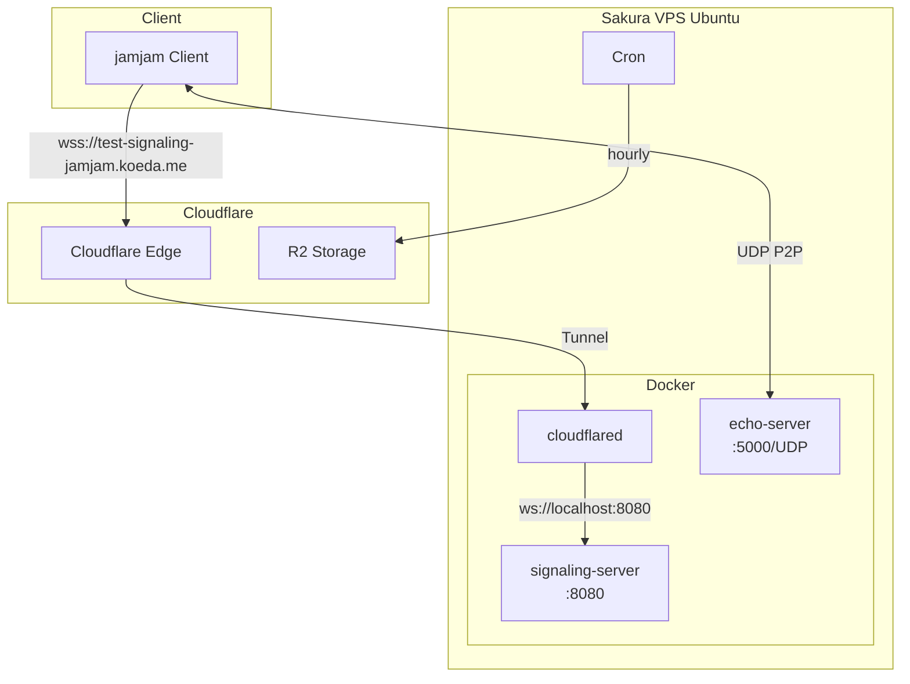

# VPS Setup Guide

jamjamテスト環境をさくらVPS上にDockerで構築する手順。

## System Architecture



## Prerequisites

- さくらVPS 1G以上 (Ubuntu 24.04 LTS)
- Cloudflare アカウント
- 管理するドメイン (例: koeda.me)

## 1. VPS Initial Setup

### 1.1 SSH Access

```bash
ssh root@<vps-ip>
```

### 1.2 Create User

```bash
# Create jamjam user
adduser jamjam
usermod -aG sudo jamjam

# Setup SSH key
mkdir -p /home/jamjam/.ssh
cp ~/.ssh/authorized_keys /home/jamjam/.ssh/
chown -R jamjam:jamjam /home/jamjam/.ssh
chmod 700 /home/jamjam/.ssh
chmod 600 /home/jamjam/.ssh/authorized_keys
```

### 1.3 Secure SSH

```bash
# Edit /etc/ssh/sshd_config
PermitRootLogin no
PasswordAuthentication no
PubkeyAuthentication yes

# Restart SSH
systemctl restart sshd
```

### 1.4 Update System

```bash
apt update && apt upgrade -y
apt install -y curl git
```

## 2. Install Docker

```bash
# Install Docker
curl -fsSL https://get.docker.com | sh

# Add user to docker group
usermod -aG docker jamjam

# Enable Docker service
systemctl enable docker

# Logout and login again to apply group changes
```

## 3. Install rclone (for R2 log upload)

```bash
curl https://rclone.org/install.sh | sudo bash
```

## 4. Firewall Setup

```bash
ufw allow ssh
ufw allow 5000/udp  # Echo server
ufw enable
```

Note: Signaling server is exposed via Cloudflare Tunnel, no direct port needed.

## 5. Cloudflare Tunnel Setup

### 5.1 Create Tunnel

1. Go to [Cloudflare Zero Trust Dashboard](https://one.dash.cloudflare.com/)
2. Navigate to **Access** > **Tunnels**
3. Click **Create a tunnel**
4. Name: `jamjam-test`
5. Copy the tunnel token

### 5.2 Configure Public Hostname

In the tunnel configuration, add:

| Public Hostname | Service |
|-----------------|---------|
| test-signaling-jamjam.koeda.me | http://signaling-server:8080 |

Enable **WebSockets** in Additional application settings.

## 6. Cloudflare R2 Setup

### 6.1 Create Bucket

1. Go to Cloudflare Dashboard > R2
2. Create bucket: `jamjam-logs`

### 6.2 Create API Token

1. Go to **Manage R2 API Tokens**
2. Create token with **Object Read & Write** permission
3. Note the Access Key ID and Secret Access Key

### 6.3 Configure rclone

```bash
rclone config

# Choose: n (new remote)
# name: r2
# Storage: s3
# provider: Cloudflare
# access_key_id: <your access key>
# secret_access_key: <your secret key>
# endpoint: https://<account_id>.r2.cloudflarestorage.com
```

Test connection:

```bash
rclone ls r2:jamjam-logs
```

## 7. Deploy Application

### 7.1 Clone Repository

```bash
sudo mkdir -p /opt/jamjam
sudo chown jamjam:jamjam /opt/jamjam
cd /opt/jamjam

git clone https://github.com/koedame/p2paudiosession.git app
cd app
```

### 7.2 Configure Environment

```bash
cp .env.example .env

# Edit .env
nano .env
```

Required settings:

```
CLOUDFLARE_TUNNEL_TOKEN=<your tunnel token>
ECHO_DELAY_MS=3000
RUST_LOG=info
```

### 7.3 Build and Start

```bash
# Build images (takes ~5-10 minutes on first run)
docker compose build

# Start services
docker compose up -d

# Check status
docker compose ps

# View logs
docker compose logs -f
```

## 8. Setup Log Upload

### 8.1 Configure Cron

```bash
# Edit crontab
crontab -e

# Add hourly log upload
0 * * * * /opt/jamjam/app/scripts/upload-logs-to-r2.sh >> /var/log/jamjam-log-upload.log 2>&1
```

### 8.2 Test Upload

```bash
/opt/jamjam/app/scripts/upload-logs-to-r2.sh --since 24h
```

## 9. Verification

### 9.1 Check Services

```bash
# All services should show "Up"
docker compose ps

# Check signaling server logs
docker compose logs signaling-server

# Check echo server logs
docker compose logs echo-server
```

### 9.2 Test Signaling Server

```bash
# Install websocat
apt install websocat

# Connect to signaling server (via Cloudflare Tunnel)
websocat wss://test-signaling-jamjam.koeda.me

# Send test message
{"type":"ListRooms"}
# Expected response: {"type":"RoomList","data":{"rooms":[]}}
```

### 9.3 Test Echo Server

From local machine:

```bash
# Send UDP packet to echo server
echo -n "test" | nc -u <vps-ip> 5000
```

Full audio test requires jamjam client application.

## 10. Maintenance

### 10.1 Update Application

```bash
cd /opt/jamjam/app
git pull
docker compose build
docker compose up -d
```

### 10.2 View Logs

```bash
# Real-time logs
docker compose logs -f

# Specific service
docker compose logs -f signaling-server

# Last 100 lines
docker compose logs --tail 100
```

### 10.3 Restart Services

```bash
docker compose restart

# Restart specific service
docker compose restart signaling-server
```

### 10.4 Check Resource Usage

```bash
docker stats
```

## Troubleshooting

### Cloudflare Tunnel Not Connecting

```bash
docker compose logs cloudflared
```

Check:
- Tunnel token is correct in `.env`
- Tunnel is enabled in Cloudflare Dashboard

### Echo Server Not Receiving Packets

```bash
# Check if port is open
sudo ufw status
sudo ss -ulnp | grep 5000

# Check Docker port mapping
docker compose ps
```

### High Memory Usage

```bash
# Check container memory
docker stats --no-stream

# Restart services
docker compose restart
```

## Cost Estimation

| Item | Monthly Cost |
|------|-------------|
| Sakura VPS 1G | ~700 JPY |
| Cloudflare Tunnel | Free |
| Cloudflare R2 (10GB) | ~50 JPY |
| **Total** | **~750 JPY** |
